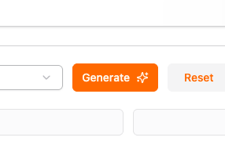
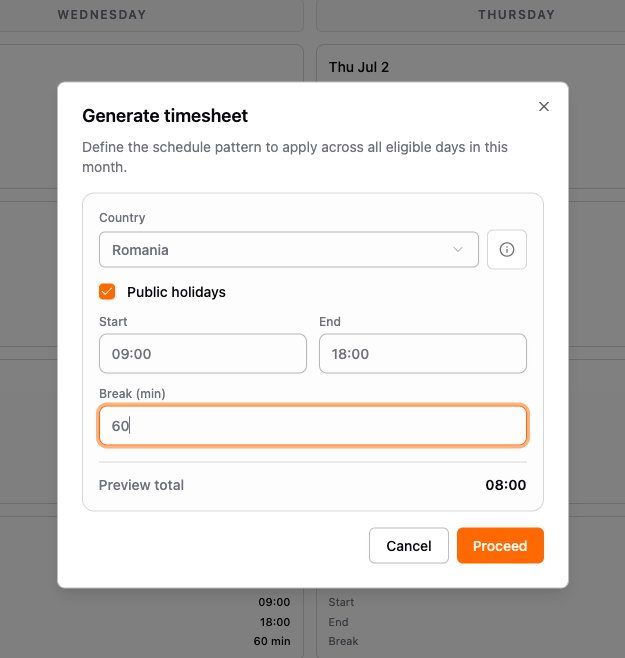
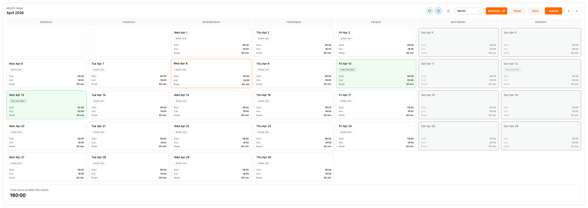

# Why I Built SimpleTimesheet and What Advantages It Brings Over Other Apps

App https://simpletimesheeet.eu  
Contents [contents.md](../contents.md)

---

## Why I built SimpleTimesheet

I built simpletimesheeet because I had the problem myself. I needed to fill in timesheets every month, and every month I hit the same wall, public holidays. I would search the internet for my country's public holidays for that month, cross-check the dates by hand, and more than once I still missed one and had to go back and fix a submitted timesheet. A small task that kept eating real time, over and over, for something that should have been automatic.

Simpletimesheeet is already built and live. The code is private, this series isn't about opening up the repo, it's a written breakdown of how and why it was built, covering the decisions, the mistakes, the cost, all of it, explained after the fact instead of staying in my own notes.

Why write it up at all instead of just shipping quietly and moving on?

- **It keeps me honest.** Publishing the real architecture and the real decisions means no revisionist history, you see what was actually built and why, not a polished highlight reel.
- **It compounds.** Every post is a tutorial someone can learn from today, and a reason for the next person to try the product tomorrow. A launch tweet gets one day of attention. A 51-post series gets found for years.
- **It builds trust before the ask.** By the time someone tries simpletimesheeet, they've already read how the auth layer works, how the data is encrypted, how GDPR consent is handled, described in detail, even though the code itself stays private. Trust isn't a claim on a landing page, it's an explanation.
- **It creates a feedback loop.** Readers point out what's confusing or missing while the product is still small and cheap to change.

This series is 51 posts across 6 arcs, covering why and the stack, the Go backend, the local dev environment, the Next.js frontend, the marketing site, the infrastructure, and compliance/cost/lessons. See the [full contents table](../contents.md) for the whole map.

## What advantage the Generate feature actually brings

Here's the problem with a classic timesheet, whether it's a spreadsheet or a bare-bones app. Every month you're back in the file, retyping the same start time, end time, and break for every single workday. Twenty-some rows, copy-pasted and hand-edited, hoping you don't fat-finger a formula or leave a day blank. Then you still have to go hunt down the public holidays yourself.

Simpletimesheeet replaces all of that with one flow, **Generate**. Here's what it looks like, step by step.

**Step 1: hit Generate.**

One button in the toolbar opens the flow. No template to open, no last month's file to copy.

**Step 2: set the pattern.**

You pick a country (Romania in the screenshot), leave "Public holidays" checked, and set a start time, end time, and break, once. No per-day setup, no formulas.

**Step 3: public holidays are already excluded for the country I picked.**

With that one checkbox left on, the generator grabs the exact public holidays for the selected country and keeps them out of the month. No searching the internet for this year's holiday list, no cross-checking dates, no missed holiday that turns into a correction later. That was the exact problem I used to have, solved by one checkbox.

**Step 4: hit Proceed and the whole month fills itself in.**

Every eligible weekday in April gets a "Work day" entry with the exact schedule you defined, start 09:00, end 18:00, 60 minute break, repeated automatically across the month. Weekends stay untouched, and the days tagged "Pub holiday" (Apr 10 and Apr 13 here) are left at 00:00 instead of counting as work. The month total, 160:00, is calculated at the bottom without me adding a single number by hand.

The result, one click produces a month that is already accurate, correct working days, correct holidays excluded for the right country, ready to log hours against. That's the whole pitch for why a purpose-built tool beats a general-purpose spreadsheet or a bloated enterprise app. The domain knowledge, what counts as a working day, what's a public holiday, in which country, is baked into the product, not left as homework for the user.

---

Try it free, https://simpletimesheeet.eu
