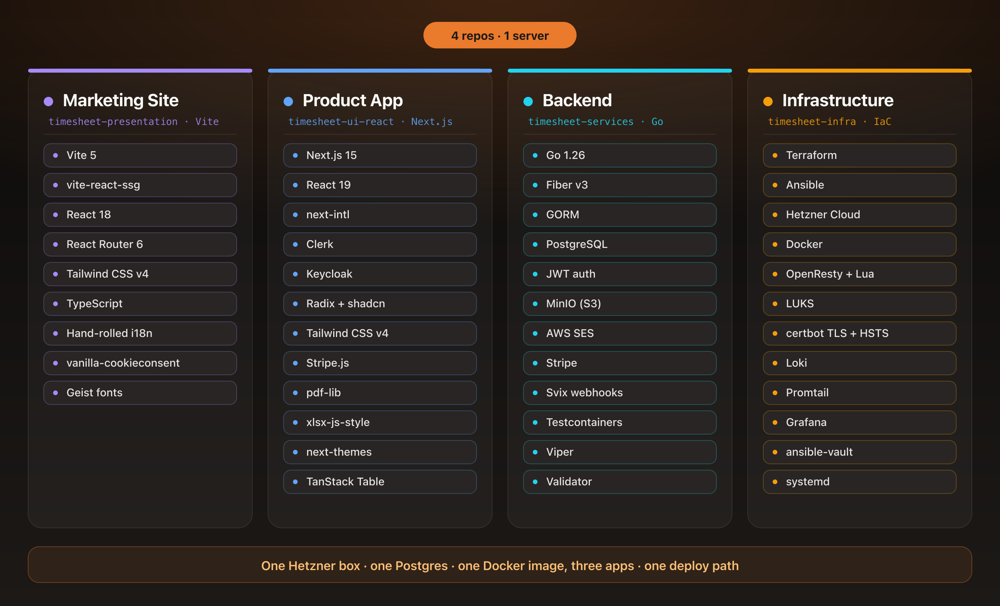

# The Full Tech Stack on One Slide (and Why)

App https://simpletimesheeet.eu  
Contents [contents.md](../contents.md)

---

When I sat down to pick the stack, I did not open a list of trendy tools. I opened a blank terminal and asked one question about every single choice. Can I own this end to end, run it cheap, and still sleep at night as the only person on call. I am one developer with no platform team and no budget for surprises, so that question was not a preference, it was the whole design. Everything on the slide below is what survived it.

The easiest way to see why each piece is there is to follow a single user through it.

Someone hears about simpletimesheeet and lands on the marketing page first. That page is a tiny Vite site, deliberately kept apart from the product. A landing page and an app want opposite things, one has to be feather light and perfect for a link preview, the other has to be rich and interactive. Keeping them separate means I can rewrite the sales pitch a hundred times without ever touching the app, and a marketing bug can never take down someone's timesheet. The payoff is visible in the numbers, the whole landing page ships as a 1.4 MB production build inside a 93 MB image. That is the advantage, two small clear jobs instead of one tangled big one.

They like it, so they sign up and cross into the product, a Next.js app. This is the one place I happily reach for a bigger toolbox, because it is the one place the user actually lives. React is the reason none of this is hand rolled, its component model lets me build the timesheet grid once and reuse it everywhere, and its ecosystem means accessible menus, dialogs, and tables already exist and are battle tested by millions of apps before mine. Next.js then wraps React with routing, server rendering, and a standalone build that ships as one lean container, so I get clean bilingual text in English and Romanian and dark mode with no ugly flash on load without gluing ten libraries together myself. Here, richness is the feature, so I let the framework be generous.

Every action they take quietly calls the backend, and the backend is Go. The job here is plumbing done correctly, check who you are, run a little holiday and date logic, talk to the database, hand back clean data. Go is boring in the best possible way for that. Around 7,800 lines of it compile down to a single 20 MB binary with no runtime and no interpreter beside it, small enough to drop into an empty container, and the rules read like plain instructions a year later. On top of Go I run Fiber, which is built on fasthttp instead of the standard net/http. That foundation reuses request objects and buffers instead of allocating fresh ones on every call, which is why fasthttp based servers sit near the top of independent Go benchmarks. In practice this backend has been running for two days on about 75 MB of memory while barely touching the CPU, so it leaves almost the entire server free for everything else. The value of the product lives in the holiday and time rules, not in a clever framework, so the framework stays out of the way.

And under all of it sits the part most solo projects hide, the infrastructure, written as code in Terraform and Ansible. This is the piece I am proudest of. If the server ever dies I do not want tribal knowledge and a bad afternoon, I want to run one command and watch an identical box rebuild itself, encrypted volume, proxy, certificates, backups, and app included. Ansible is what makes that promise real. It is agentless, so there is nothing to install on the server first, and it describes the state I want rather than the steps to get there, so running it twice changes nothing the second time. The whole machine, from the encrypted disk to the running app, is a set of readable roles I can review in a pull request instead of a folder of forgotten shell scripts. Owned, repeatable, and calm.

The obvious question is why not just reach for Vercel and Supabase like everyone else. They are genuinely great for starting fast, and that is exactly the trap. Their bills are built to grow with you, you pay per seat, per request, and per gigabyte of bandwidth, so the more successful the product gets the more the platform charges for the same work. You also cannot fully see inside them, when something misbehaves you are filing a support ticket instead of reading your own logs. My setup inverts that. The server is a flat monthly cost whether ten people use it or ten thousand, I self host the same jobs those platforms would rent me, auth, storage, email, and logging, and when something breaks I can open every box myself. It is more work up front, and in my opinion it is the better trade for anything you plan to run for years.

The quiet punchline is where all four pieces end up. One modest Hetzner box. One Postgres. The three apps packaged into a single image and supervised as one unit, with their own logs and metrics on the same machine instead of shipped to a per gigabyte bill.

Here is what that actually weighs, measured on the live stack.

| Piece | Tech | Size and footprint |
| --- | --- | --- |
| Backend | Go on Fiber (fasthttp) | 20 MB static binary, ~74 MB RAM, ~0% CPU idle |
| Marketing site | Vite static build | 1.4 MB bundle, 93 MB image |
| Reverse proxy | nginx | ~2.8 MB RAM |
| Database | Postgres 17 | ~54 MB RAM |

Numbers taken with `docker stats` on the running stack while idle. The backend is around 7,800 lines of Go with 18 direct dependencies. The whole thing leaves most of the machine sitting free.

People assume a bilingual, compliant, multi repo SaaS must sprawl across a cloud account. It does not. It fits on one server that costs less than a dinner out, because every choice came from the same question. Own it, run it cheap, and stay able to sleep.

The next posts open each box and go deep on the decisions inside.

---

