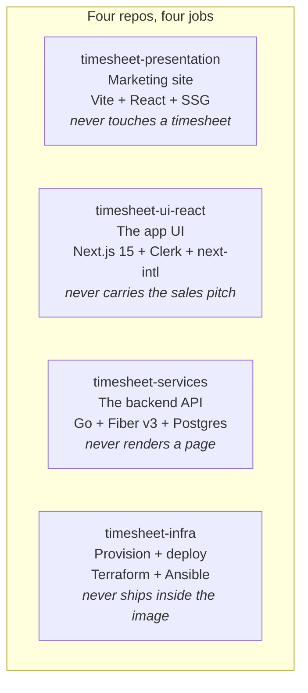
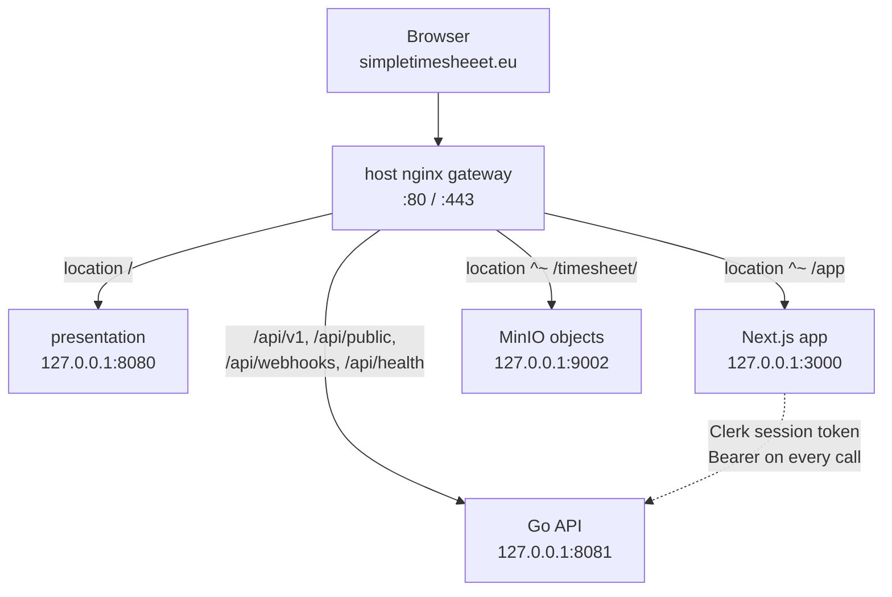
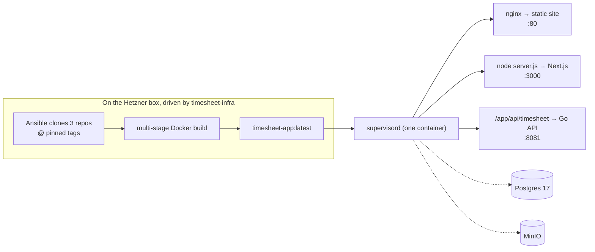
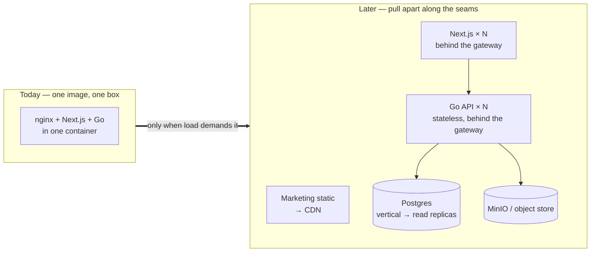

# Four Repos, One Product: Simple but Effective Architecture

App https://simpletimesheeet.eu  
Contents [contents.md](../contents.md)

---

If you tell a room of engineers that a one-person SaaS is split across four Git repositories, half of them will wince. Four repos sounds like the exact over-engineering a solo developer is warned about, the microservice cosplay that turns a weekend project into a distributed systems problem you now have to babysit alone. I split simpletimesheeet into four repos anyway, and it is one of the decisions I am happiest about. The reason it works is that the split is about boundaries, not about distribution. Four repos at the desk, one image on the server. That is the whole story, and everything good about this architecture falls out of holding those two facts at once.

Start with the desk. Each repo owns exactly one job, and just as importantly, each one is forbidden from doing the others.

`timesheet-presentation` is the public landing page, a Vite site prerendered to static HTML with `vite-react-ssg`, no auth, no API calls, deliberately feather light. `timesheet-ui-react` is the product itself, a Next.js 15 App Router application with React 19, Clerk for auth and next-intl for English and Romanian, running under a `/app` base path. `timesheet-services` is the Go backend, Fiber v3 on top of Postgres 17, the only thing allowed to touch the database and the domain rules. And `timesheet-infra` is Terraform and Ansible, the repo that builds and deploys the other three but is never compiled into them.

That list of jobs is really a list of things each box must never do, and the negative space is where the value hides. A marketing bug cannot take down a timesheet because the marketing repo has no code path to a timesheet. The backend cannot leak a rendering concern into an API because it has no renderer. Because those walls are real, each repo is also free to pick the stack that fits its own job and nothing else. The landing page hand-rolls a two-language dictionary because a full i18n library would be overkill; the app pulls in next-intl and shadcn/ui because richness is the point there; the backend stays a single static Go binary with no runtime beside it. The landing page can sit on React 18 while the app runs React 19, and the backend can upgrade Go on a schedule that touches nobody else. A version bump becomes a local decision instead of a company-wide event, and that is only possible because the boundaries were drawn in the first place.

There is a quieter benefit to splitting by job, which is that you also split by privilege. The marketing site is the most exposed thing on the internet, the page every stranger and every bot hits first, and it holds nothing worth stealing. No secrets, no database connection, no authenticated code path, because it is static HTML. The credentials that matter, the database password, the Stripe keys, the SES and MinIO secrets, live only in the Go backend, the one repo that actually needs them, and Postgres and MinIO are published to loopback only so they never touch the public network at all. A single sprawling app would sit a template bug and a database query in the same process with the same permissions. Four boxes keep the dangerous parts small and in one place.

## The user never feels the seams

None of this would be worth it if the visitor could tell there were four repos back there. They cannot, because everything lives behind a single origin. One host-level nginx gateway (OpenResty, TLS from Certbot) sits at the front and routes purely by path prefix to three loopback-only upstreams.

Follow one visitor and the whole map falls out. They hit `/` and the gateway hands them the prerendered marketing page. They click "Get Started," which points at `/app/en/sign-in`, and `location ^~ /app` sends them into the Next.js app. That `/app` prefix is not a coincidence, it is the `basePath: '/app'` set in the app's `next.config.ts`, lined up exactly with the nginx location so the two always agree on where the app lives. Once signed in, every action calls something like `/api/v1/users/current`, and the `/api` locations route that to the Go backend.

Because it is all one origin, the browser never makes a cross-site request and never sees three separate apps. There are no CORS gymnastics, no second domain to certify, no preflight round-trips. Auth rides along just as cleanly: Clerk issues a session token in the Next.js app, the app attaches it as a `Bearer` header on every `/api/v1` call, and the Go backend validates that JWT against Clerk's JWKS before it does anything. Three repos, one login, one origin, and not a seam the user can feel. The split is a fact about my desk, not about their browser.

## Four repos, one image

Here is where the two halves of the story meet. At the desk there are four repos. On the server there is one container. Three of the four compile into a single image called `timesheet-app:latest`, built by one multi-stage Dockerfile that pulls each repo in as its own build context: the Vite site builds to static files, the Next.js app builds to a standalone Node server, and the Go code compiles to a single static binary. The fourth repo, `timesheet-infra`, is never inside the image. It is the thing holding the camera.

At deploy time Ansible clones the three app repos at pinned tags, builds the combined image right on the server, and templates a small Docker Compose stack. Inside that one container, supervisord runs three processes side by side: nginx serving the static marketing files, `node server.js` running the Next.js app on port 3000, and the Go binary on port 8081. Alongside it on the same box sit one Postgres 17 and one MinIO, on a single private network, with all their data on one encrypted `/mnt/data` volume. One modest Hetzner VM, one database, three processes that started life as three repos.

Collapsing to one image is what makes the four-repo split affordable, because it erases everything I would otherwise have to run. No service mesh, no inter-service network to secure, no message bus, no orchestrator, no cluster of machines drifting out of sync. When something breaks there is exactly one container to inspect and one set of logs to read, not four deployments where the first job is guessing which one is broken. And because infra assembles the image from pinned Git tags, a release is a precise named thing rather than whatever happened to be on main, which makes the whole system reproducible and a rollback nothing more than building the previous set of tags again. Multi-repo gives me the clean boundaries; the single image gives me a monolith's operational calm. I get the good half of each and pay for neither.

## Why one image, for now

The honest reason there is a single image today is that the load does not justify anything more. As I write this the whole stack idles on a fraction of one Hetzner box, the backend sitting around 75 MB of memory while barely touching the CPU, which means the machine is almost entirely headroom. Splitting the three processes onto separate machines right now would add a load balancer, an internal network, several deploys to coordinate, and a bigger bill, in exchange for solving a scaling problem I do not have. That is the definition of premature. At this size the single image is not a compromise, it is the correct answer: one thing to deploy, one thing to watch, one flat monthly cost whether ten people use it or ten thousand, and an entire server in reserve for when growth actually arrives.

The important part is that choosing simplicity now does not paint me into a corner later, because the boundaries that let the pieces share one image are the same boundaries that let them leave it. The three processes are already separated by concern, already talk only through the gateway and the API, and are already built from independent repos at independent versions. Growing up is therefore a deployment change, not a rewrite.

The path has an obvious order, cheapest first. The very first move is vertical: Hetzner resizes to a bigger CPU and RAM tier in minutes, and since the stack is currently using a sliver of a small box, that single step buys a large multiple of today's traffic for a few more euros a month. When one box genuinely runs out of room, the split follows the seams that already exist.

Each piece scales in the way that suits it. The marketing site is already static HTML, so the moment traffic to the landing page matters it goes onto a CDN and effectively stops being my problem. The Next.js app and the Go API are both stateless, they hold no session in memory and lean on Clerk for identity and Postgres for state, so scaling either one is just running more copies behind the same gateway and letting it spread the load. The real limit, as it almost always is, will be the database, and that has its own well-worn ladder: vertical first, then connection pooling, then read replicas for the read-heavy timesheet queries, long before anything as drastic as sharding is on the table. MinIO is already a separate concern and can move to managed object storage without touching a line of the app.

None of that is built today, and deliberately so. The point of the single image is that I get to defer every one of those steps until a real user count asks for it, while knowing the architecture already has the seams cut where each future split will go. Simple now, and shaped so that scaling later is unbolting pieces rather than rebuilding the machine.

## The point

The repo count is a decision about my desk, not about the server, and that is exactly why it costs nothing at runtime. Four repos is how the code is organized while I work, so that each piece has one job, one boundary, one fitting toolset, and a footprint small enough to hold in my head a year from now. One image on one Hetzner box is how it runs, so that there is almost nothing to operate. And the same walls that keep me fast today are the ones that would let a second person own the marketing site tomorrow without ever touching the backend. Post 2 ended on "one modest Hetzner box," and this is the shape of what sits on it: four clean boxes at the desk that collapse into a single supervised container the moment they ship.

The next posts open each of those boxes and go deep, starting with the Go backend and the domain rules that are the actual reason any of this exists.
