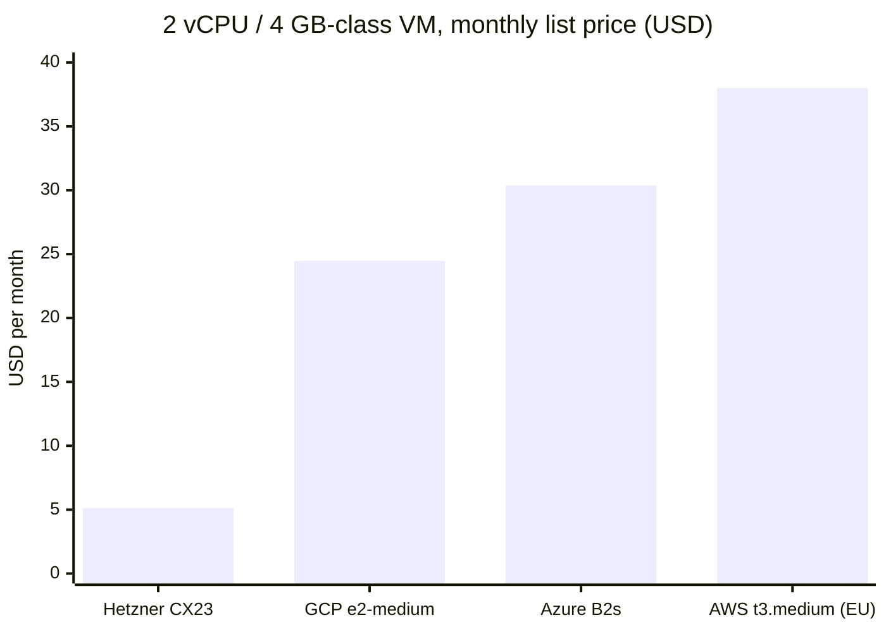
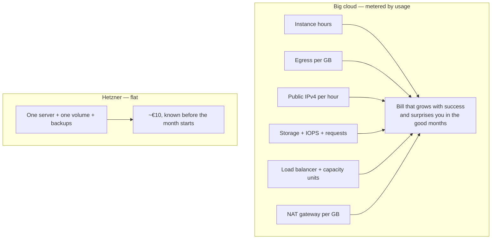
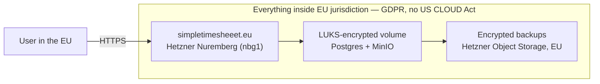
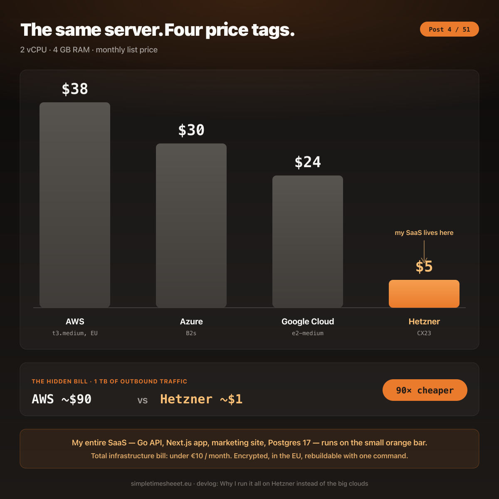

# Why I Run It All on Hetzner Instead of the Big Clouds

App https://simpletimesheeet.eu  
Contents [contents.md](../contents.md)

---

Every time I tell another engineer that simpletimesheeet runs entirely on Hetzner, I get one of two reactions. Engineers who have run their own side projects nod immediately, and engineers who have only ever deployed inside a company AWS account ask if that's, you know, *safe*. This post is my full answer to the second group, with real numbers, because the choice of where to run a product is not a detail. For a solo developer it decides whether the project survives its first quiet year.

Here is the decision in one sentence. Simpletimesheeet is a European product, built by a European developer, for users protected by European law, and it needs almost no compute. Hetzner wins on every one of those axes, and the big clouds win on axes I don't sit on. The rest of this post is just unpacking that sentence.

## What I actually run, and what it costs

There is no mystery box here. The entire production footprint is described in the Terraform of `timesheet-infra`:

- **One CX22 cloud server** in Nuremberg (`nbg1`): 2 shared vCPUs, 4 GB RAM, 40 GB NVMe, and 20 TB of included traffic, for **€3.79 a month**.
- **One 10 GB block volume**, LUKS-encrypted, holding Postgres and MinIO data, for cents.
- **Hetzner Object Storage** (their S3-compatible service) for off-site encrypted backups.
- One IPv4 address, one firewall, one private network. All of it, of course, in code.

That's the whole cloud account. Everything from post 2, the Go API, the Next.js app, the marketing site, Postgres 17, MinIO, the Loki and Grafana observability stack, lives on that one machine and its one volume. The full monthly infrastructure bill lands under ten euros. Post 50 breaks down the complete cost of running the business, but the hosting line alone is less than two coffees.

For the non-technical readers: a "cloud server" is just a computer in someone else's building that you rent by the month. The big clouds rent you the same computer sliced into a dozen separately-metered services. Hetzner rents you the computer.

## The math nobody shows you on one slide

Talking about "cheaper" is hand-waving, so here are like-for-like list prices, taken from [GetDeploying's AWS vs Hetzner comparison](https://getdeploying.com/aws-vs-hetzner) as I write this:

| What you're buying | Hetzner | AWS |
| --- | --- | --- |
| Small VM, 2 vCPU / 4 GB RAM | $5.13/mo (CX23) | ~$38/mo (t3.medium, EU, storage extra) |
| VM, 8 vCPU / 16 GB RAM | $14.28/mo (CX43) | $248.20/mo (c5.2xlarge) |
| Block storage, 100 GB | $5.03/mo | $8.00/mo |
| Object storage, 1 TB | $5.72/mo | $24.63/mo |
| Load balancer | $7.33/mo | $22.57/mo |
| Included outbound traffic | 20 TB per server | 100 GB per account |
| Extra outbound traffic, per TB | ~$1.14 | ~$90.00 |

Read the last two rows of that table again, because they are the trap that catches almost everyone. On the big clouds the server is not the bill. **Egress is the bill.** Egress is just "data leaving the server", every page view, every PDF export, every API response your users download. AWS gives you 100 GB free and then charges around $90 per terabyte. Hetzner includes 20 terabytes with a €3.79 server and charges about a euro per terabyte after that. It is the same bytes over the same internet, priced two orders of magnitude apart. For a SaaS whose entire job is sending timesheets to browsers, that difference isn't an optimization, it's the business model.

And it changes how the bill *behaves*, not just how big it is:

I wrote in post 2 that my server costs the same whether ten people use it or ten thousand. This diagram is why. A metered bill punishes growth; a flat bill ignores it. As a solo founder, a bill I can predict a year in advance is worth more to me than any amount of managed convenience, because the most likely way a side project dies is not a technical failure, it's a founder looking at a creeping invoice during a slow month and deciding it isn't worth it.

## But is the cheap hardware actually good? The benchmarks

Fair question, and I'll answer it honestly instead of with marketing. Here is what independent benchmarks say about my exact server type, the CX22, per [Spare Cores](https://sparecores.com/server/hcloud/cx22):

| Benchmark | CX22 score |
| --- | --- |
| Geekbench single-core | 548 |
| Geekbench multi-core | 1,005 |
| PassMark CPU mark | 2,158 |
| PassMark single-thread | 1,432 |

Let me translate: **this is not a fast computer.** A modern laptop beats it several times over on single-core work, and AWS's newest Sapphire Rapids instances beat it comfortably too, at roughly ten times the price. [VPSBenchmarks](https://www.vpsbenchmarks.com/hosters/hetzner/plans/cx22) grades the CX22 a C overall, with one interesting exception, network performance, where it scores a B, which matters more than it looks for a product that is mostly "receive request, query Postgres, send JSON back."

So why am I comfortable on a C-grade machine? Because of the numbers from my own `docker stats`, measured on the live stack: the Go backend idles at about **75 MB of RAM and roughly 0% CPU**, Postgres sits at 54 MB, nginx at under 3 MB. The product's workload is small reads and writes of timesheet rows, not video encoding. Buying peak single-core performance for this workload would be like buying a truck to deliver letters. The benchmark that actually matters for simpletimesheeet is performance per euro, and there the CX22 is nearly unbeatable: paired with the fasthttp-based Go backend from post 2, this "slow" machine has headroom for orders of magnitude more users than it currently serves. When it genuinely runs out, post 3 already showed the escape hatch, Hetzner resizes to a bigger tier in minutes, and even their top shared plan costs less than the *entry-level* comparable AWS instance.

There is a subtle honesty point here that I think builds more trust than any benchmark. The big clouds are faster at the top end. If I were training models or serving a million concurrent users, this post would be different. I am not, and pretending my workload needs m7i instances would just be cosplay paid for at $248 a month.

## AWS vs Google Cloud vs Azure vs Hetzner, for *this* product

It's worth lining all four up properly, because each of the big three is genuinely excellent, just at things simpletimesheeet doesn't need yet. List prices for the class of machine I actually run, 2 vCPU and 4 GB of RAM:

| | Hetzner (CX23) | GCP (e2-medium) | Azure (B2s) | AWS (t3.medium, EU) |
| --- | --- | --- | --- | --- |
| Comparable VM, monthly | **~$5** | ~$24 | ~$30 | ~$38 |
| Included egress | 20 TB per server | ~200 GB | 100 GB | 100 GB |
| Extra egress, per TB | ~$1 | ~$85–120 | ~$87 | ~$90 |
| Billing model | Flat, predictable | Metered | Metered | Metered |
| What it's truly great at | Raw compute per euro, EU jurisdiction | Data/ML, BigQuery, global network | Enterprise, Microsoft 365 / Entra ID integration | Breadth: 200+ managed services, hiring pool |

For this product, the comparison is lopsided in ways that go beyond the VM price:

**Against AWS**, the killer feature I'd be paying for is the catalog, RDS, SQS, Lambda, two hundred services I could assemble instead of build. But post 3 showed the whole product is three processes and a database on one box. I don't need the catalog; I'd be paying a 7x premium on compute and a 90x premium on bandwidth to have it on standby.

**Against Google Cloud**, the honest pull is the data platform and the best global network in the business. If simpletimesheeet were an analytics product crunching terabytes, BigQuery alone would justify the bill. It's a CRUD app whose biggest query is "give me this user's month." GCP's sustained-use discounts and free tier are friendlier than AWS's, but a discounted $24 still loses to $5, and their egress is priced in the same painful universe.

**Against Azure**, the real argument is enterprise sales: if my customers were corporations demanding Entra ID single sign-on and vendor questionnaires answered with Microsoft logos, Azure would practically be a requirement. My customers are contractors and small teams signing in with an email. And Azure is, ironically, the most expensive of the three for this VM class.

Notice what all three have in common: their pricing model assumes you'll grow into them. Free credits at the start, metered everything after. That's a rational bet for a venture-backed startup burning toward scale. For a bootstrapped product that must be profitable at small size, the flat €10 wins every month it survives.

**And here is the honest counterweight: this decision has an expiry condition.** If simpletimesheeet grows to the point where Hetzner stops providing the right tools, I'll move, and it would be the correct move, not a defeat. The concrete triggers are already known: needing a managed Postgres with real high availability and point-in-time recovery instead of my own backup scripts, needing low latency on continents where Hetzner has no data center, needing autoscaling for genuinely spiky load, or landing enterprise customers whose compliance checklists demand a hyperscaler's certification portfolio. The architecture is deliberately built so that exit stays cheap: everything ships as standard Docker containers, the database is plain Postgres, file storage is S3-compatible MinIO, and provisioning is Terraform, none of it welded to a Hetzner-only API. Migrating would mean changing the Terraform provider and the hostnames, not rewriting the product. Choosing Hetzner today isn't a marriage; it's the right tool for the current size, held with a grip loose enough to let go.

## The identity part: a European product on European ground

This is the part of the decision that had nothing to do with money, and honestly it's the part I care most about.

Simpletimesheeet lives on a `.eu` domain, ships in English and Romanian, prices in multiple currencies, and is built around GDPR from day one, pseudonymous consent, audit logs, scheduled deletion, the whole arc 5 of this series. It would be a strange product that promises European data protection on its landing page and then quietly ships every byte to a hyperscaler governed from another continent.

Hetzner is the boringly perfect match for that promise. It is a German company, family-owned since Martin Hetzner founded it in 1997, and it **owns its own data centers** in Nuremberg, Falkenstein, and Helsinki rather than renting capacity from someone else. My server sits physically in Nuremberg. That means the data is subject to German and EU law, full stop, with no exposure to the US CLOUD Act, the American law that can compel US-based providers to hand over data regardless of which country the server is in. When a GDPR-conscious customer asks me where their timesheets live, the answer is one sentence with no asterisks: on an encrypted disk in Bavaria, under EU jurisdiction, at a company that has been doing exactly this for almost thirty years.

There's a smaller identity point that still counts for me: every one of those data centers runs on 100% renewable energy, hydropower in Germany and wind in Finland. And there's a personal one. I'm a European developer building for a market that Silicon Valley defaults mostly ignore, bilingual UIs, EU public holidays, EU privacy law as a feature rather than a compliance chore. Running the whole thing on European infrastructure isn't just consistent branding. It's the same decision as the rest of the product, made at the infrastructure layer.

## What I gave up, honestly

Choosing Hetzner is not free. It's worth being precise about the price you pay in things other than money, because this is where the big clouds genuinely earn theirs.

**There are no managed services.** No RDS, no managed Kubernetes worth speaking of, no Lambda, no army of ready-made building blocks. My Postgres is my problem: I run it, back it up, and will one day restore it under stress. My answer to that is the whole of arc 4, Terraform and Ansible turn "my problem" into code I can review, so the platform team I don't have is replaced by a repo I do.

**Fewer regions.** Hetzner has a handful of locations in Europe, the US, and Singapore. If my users were spread across five continents demanding sub-50ms latency, this would hurt. They're mostly in Europe, sitting a few network hops from Nuremberg, so it doesn't.

**Fewer safety nets.** No enterprise support plan, no account manager, a 1 Gbps shared network port instead of 50 Gbps burst. The trade is symmetrical though: I also have no surprise NAT gateway charges, no per-request pricing on anything, and no console with two hundred services in the sidebar to audit.

The honest framing is this: the big clouds sell you the ability to *not know* how your infrastructure works, and they price that ability generously. I decided early that on a one-person product, understanding every box is not a cost, it's the moat. The same post-2 question decided it, can I own this end to end, run it cheap, and sleep at night. Hetzner is the only answer I found that satisfies all three at once.

## The point

Strip away the benchmarks and the tables and the choice looks like this. The big clouds are built for teams that need infinite elasticity and are willing to pay a metered premium for it. I am one person with a Go binary that idles at 75 MB, a user base under European law, and a strong preference for bills that never surprise me. For that shape of problem, a €3.79 server in Nuremberg with 20 TB of traffic, owned end to end and rebuildable with one command, isn't the budget option. It's the correct engineering answer, and the fact that it's also the cheapest one is just the market being slow to notice.

The stack posts are done. Next, we open the first of the four boxes and get into the code: why the backend is written in Go.

---

*Pricing and benchmark sources, as of writing: [GetDeploying AWS vs Hetzner](https://getdeploying.com/aws-vs-hetzner), [Spare Cores CX22 benchmarks](https://sparecores.com/server/hcloud/cx22), [VPSBenchmarks CX22](https://www.vpsbenchmarks.com/hosters/hetzner/plans/cx22), [GCP e2-medium pricing](https://www.economize.cloud/resources/gcp/pricing/compute-engine/e2-medium/), [Azure B2s pricing](https://instances.vantage.sh/azure/vm/b2s), [Hetzner Cloud](https://www.hetzner.com/cloud). RAM/CPU figures for my own stack measured with `docker stats` on the live server.*

