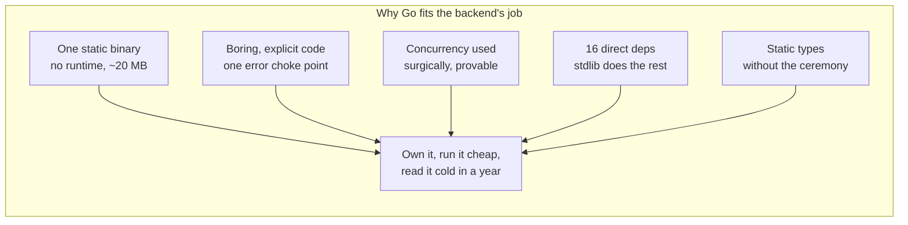
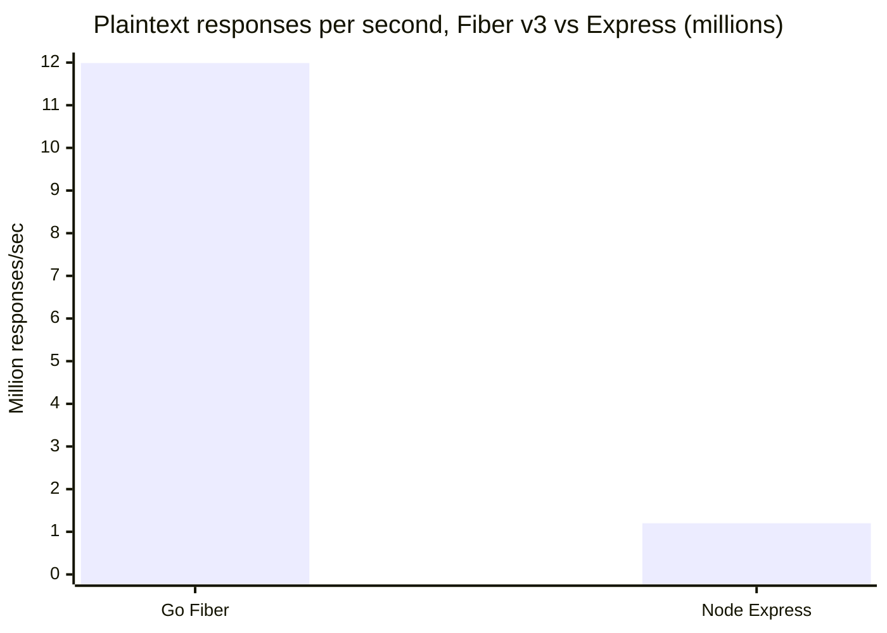
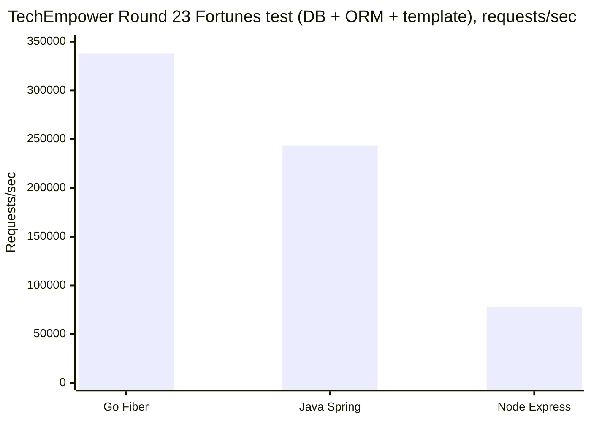

# Why I Picked Go for the Backend

App https://simpletimesheeet.eu <br>
Contents [contents.md](../contents.md)

---

Post 3 drew the four boxes and post 4 put them on a small server in Nuremberg. Now we open the first box and look at the code inside, and the first question about any backend is the language it's written in. Simpletimesheeet's backend is Go, and I want to explain that choice properly, because it wasn't made for the reason people assume. I did not pick Go because it tops a benchmark chart. I picked it because of what the backend actually does for a living.

Here is that job, described honestly. A request comes in, the backend checks who you are, runs a little holiday and date logic, reads or writes one row in Postgres, and hands back clean JSON. That's almost all of it. The value of the product lives in the rules, what counts as a working day, which day is a public holiday in which country, not in anything clever at the transport layer. The backend is plumbing, and the whole art is doing plumbing correctly. The question I asked was the same north star as the rest of the series, can one person own this, run it cheap on a 4 GB box, and still read it cold a year from now. Go is the answer I kept arriving at, and this post is why, shown in the real code.

## One file, no runtime, nothing to babysit

Start with the thing you feel the very first time you deploy. A Go program compiles to a single static binary. In simpletimesheeet's Dockerfile the backend is built with `CGO_ENABLED=0` and `-ldflags="-s -w"`, which produces a fully static executable with no dependency on the system C library and with the debug symbol table stripped out to keep it small. The result is around 20 MB of self-contained machine code. There is no interpreter beside it, no virtual machine warming up, no folder of dependencies to ship alongside. To deploy it you copy one file into an empty container and run it.

That single-file property compounds in a way that matters for a solo project. The same build stage emits two binaries from the same code, the API itself from `./cmd/timesheet`, and a separate one-shot GDPR purge worker from `./cmd/retention-purge`. The purge job reuses the exact same config and database code as the API and compiles into its own tiny executable that a systemd timer runs once a day and that then exits. No long-running daemon to watch, no shared process to endanger, just a second small file that does one job and stops.

The contrast is visible inside my own image. Post 3 explained that all three apps ride in one container. Two of them are Node apps, the product UI and the marketing site, and each of those has to carry a Node runtime and a `node_modules` tree to run at all. The Go backend is the only one of the three that is a single self-contained file. This is not a knock on Node, which earns its place in the frontend where its ecosystem is the point. It is just that for the piece whose whole promise is "boring plumbing that always comes back up," the operational win of scp-a-single-file is real. This is the reason cloud-native tooling gravitated to Go in the first place. Independent write-ups put Go binaries at roughly a tenth the size of the Java equivalent and container startup under two seconds against the ten to thirty seconds a JVM service can spend warming up. Owned, cheap, and nothing to babysit is the north star, and Go delivers it at the language layer before I've written a line of business logic.

## Boring on purpose, so I can read it in a year

The most underrated feature of Go is that it is dull to read, on purpose, and stays that way. There is one formatting style enforced by the tool, so every file in the codebase looks like every other file. Control flow is explicit, errors are values you handle in front of you rather than exceptions thrown past you, and there is very little hidden machinery. A year from now, when I have forgotten how a route works, I want to reread it like a set of plain instructions instead of reverse-engineering a framework's magic. Go is built for exactly that reread.

The clearest example is how the backend handles failure. Every kind of thing that can go wrong is a typed error, an invalid argument, a missing record, a duplicate, a rate-limit trip, an unauthorized call, and each one knows how to unwrap to its underlying cause. Then there is exactly one place, a single error handler, that translates any of them into the right HTTP status, a missing record becomes 404, a duplicate becomes 409, a bad argument becomes 400, a rate-limit trip becomes 429. When I want to understand every way a request can fail, I read one file, not fifty scattered try-catch blocks. That choke point exists because Go's error-as-value style pushed me toward it, and it is the kind of structure that pays rent every time I come back to the code.

The whole translation is one switch. The repo stays private, so this is a simplified version, but the shape in production is exactly this.

```go
// One place turns any domain error into the right HTTP status.
func HandleError(c fiber.Ctx, err error) error {
	var notFound    *NotFoundErr
	var duplicate   *AlreadyExistsErr
	var badArgument *InvalidArgErr
	var rateLimited *RateLimitErr

	switch {
	case errors.As(err, &notFound):
		return respond(c, fiber.StatusNotFound, notFound)
	case errors.As(err, &duplicate):
		return respond(c, fiber.StatusConflict, duplicate)
	case errors.As(err, &badArgument):
		return respond(c, fiber.StatusBadRequest, badArgument)
	case errors.As(err, &rateLimited):
		return respond(c, fiber.StatusTooManyRequests, rateLimited)
	default:
		return respond(c, fiber.StatusInternalServerError, err)
	}
}
```

The same plainness shows up in how the pieces are wired. Each service depends on an interface, and the concrete implementations get assembled by hand in `main.go`. There is no dependency-injection framework doing invisible reflection at startup, no annotations to decode. If you want to know what the app is made of, you read `main.go` top to bottom and it tells you. Boring is a feature when you are the only person who will ever debug it at 11pm.

## Concurrency I can reach for, and reason about

Here is where I want to be honest, because it is the opposite of the usual Go pitch. Simpletimesheeet's backend is not a swarm of goroutines. There are no channels in the production code and most work is plain, synchronous, one thing after another. Go's concurrency is famous, and I use it deliberately in a handful of places rather than everywhere, which I think is the mature way to use a sharp tool.

Where it earns its keep, it earns it well. Every authenticated request needs the identity provider's public signing keys to verify the token, and fetching those on every call would be slow and rude. So there is a small read-mostly cache guarded by a read-write mutex, many requests read the cached keys at once with no contention, and only when the keys expire does a single writer refresh them while everyone else waits a beat. That is a textbook Go pattern and it took a dozen lines.

```go
func (c *KeyCache) Get(kid string) (*rsa.PublicKey, error) {
	c.mu.RLock()
	if key, ok := c.keys[kid]; ok && time.Now().Before(c.expiry) {
		c.mu.RUnlock() // fast path, many readers at once
		return key, nil
	}
	c.mu.RUnlock()

	c.mu.Lock()
	defer c.mu.Unlock()
	// Double-check: another goroutine may have refreshed while we waited.
	if key, ok := c.keys[kid]; ok && time.Now().Before(c.expiry) {
		return key, nil
	}
	return c.refresh(kid) // one writer refreshes for everyone
}
```

Elsewhere, a context flows through every layer of the app, so when a client hangs up or a deadline passes, the cancellation propagates all the way down to the database call and the outbound HTTP request and stops the wasted work. The retry logic that calls the public-holiday API uses a select over the context and a timer, so a canceled request aborts a backoff instantly instead of sleeping through it.

The reason I trust these few concurrent paths is that Go lets me prove them. There is an integration test that fires two simultaneous writes to the same timesheet through a wait group, on purpose, to exercise the race, and the repository handles it by catching the unique-constraint collision and refetching. Go ships with a race detector I can run that test under. The point of the concurrency story is not that goroutines are exciting, it's that they are cheap and reason-able. A goroutine starts at around two to four kilobytes of stack against roughly a megabyte for an operating-system thread, so reaching for one is nearly free, and the tooling keeps me honest when I do.

## A dependency tree small enough to actually trust

For a one-person product that has to answer GDPR questions with a straight face, the code I did not write is the code I most have to worry about. Every dependency is a supply chain I am trusting and a thing I will one day have to patch under a security advisory. So the size of the dependency tree is not a tidiness preference, it is a risk budget.

The backend does authentication, card payments, object storage, transactional email, and signed webhooks, and it does all of that on sixteen direct dependencies with a lock file only a few hundred lines long. That leanness is possible because Go's standard library already includes the things other ecosystems reach for a package to do. The auth integration talks to the identity provider directly over plain `net/http` and reconstructs the RSA verification keys with the standard `crypto/rsa` package, about a hundred and sixty lines of my own code instead of a heavyweight vendored SDK. A whole month of timesheets is stored as one JSON column, and the code that serializes it uses the standard `encoding/json` with a few lines implementing the database's value interface, no ORM plugin required. Those few lines are the whole story, one method to write the column, one to read it back.

```go
// A month of intervals stored as a single JSONB column, using only stdlib.
func (l DayIntervalList) Value() (driver.Value, error) {
	return json.Marshal(l)
}

func (l *DayIntervalList) Scan(src any) error {
	bytes, ok := src.([]byte)
	if !ok {
		return errors.New("DayIntervalList: expected []byte from DB")
	}
	return json.Unmarshal(bytes, l)
}
```

The tamper-evident audit log that GDPR compliance leans on is a hash chain built on the standard `crypto/sha256`. Even the calendar math that decides how many days are in a month uses a small trick with the standard `time` package rather than a date library. Fewer moving parts to trust, fewer advisories to chase, one person can actually keep up.

## Types that catch mistakes without the ceremony

Go is statically typed, which means a whole category of mistakes never reaches production because the compiler refuses to build them. But it gets there without the heavy boilerplate people associate with older typed languages. The repositories are defined as interfaces that the services depend on, so the business logic never knows or cares which concrete database code sits underneath, and I can swap a real implementation for a fake one in a test by satisfying the same interface. Small compile-time assertions scattered through the code state "this type must implement this interface" so a drift gets caught the instant I build, not at runtime in front of a user.

```go
// The service depends on this, not on any concrete client.
type PublicHolidayClient interface {
	Holidays(ctx context.Context, country string, year int) ([]Holiday, error)
}

// If NagerClient ever drifts from the interface, the build fails here,
// not in production. A real fake for tests only has to satisfy the same shape.
var _ PublicHolidayClient = (*NagerClient)(nil)
```

That same interface discipline is what lets the auth layer be swappable. Sign-in sits behind one identity-provider interface with more than one implementation behind it, plus a local development fallback, so I can run the entire backend on my laptop with no external auth service at all and the rest of the code cannot tell the difference. The types give me a safety net and a set of clean seams, and they do it quietly, without turning every file into a wall of ceremony.



## So what does the speed actually buy me

I have said almost nothing about raw performance, which is what most Go posts lead with, and that is deliberate. But it deserves an honest paragraph, because it is real. The backend runs on Fiber, which is built on the fasthttp engine instead of Go's standard net/http. Fasthttp gets its speed from reusing request objects and buffers instead of allocating fresh ones on every call, and Fiber pools its context objects on top of that. In Fiber's own published benchmarks that foundation serves on the order of twelve million plaintext responses a second at around a millisecond of latency, against roughly one and a quarter million for Node's Express at nearly nine milliseconds.



Plaintext is a synthetic best case though, so here is a fairer picture. The TechEmpower "Fortunes" test is the one the benchmark authors call the most realistic, because it hits the database, runs an ORM, and renders a template on every request, which is much closer to what a real backend actually does. In Round 23 the ranking on that test puts Go Fiber well ahead of both a compiled rival and an interpreted one on the same hardware.



Now the honest turn, which is the same one I made about Hetzner's hardware. Simpletimesheeet does not need twelve million requests a second. It will likely never need twelve thousand. So why does the speed matter to me at all? Because throughput and footprint are two sides of one coin. The same architecture that could serve millions of requests is the reason the backend idles at about 75 MB of memory and near zero CPU, measured with `docker stats` on the live server. That tiny footprint is what lets the Go API, the Next.js app, the marketing site, Postgres, and MinIO all fit comfortably on one small CX22 box that costs less than a dinner out. I am not buying peak throughput, I am buying the headroom that comes with it, on a machine I chose precisely because it is cheap and modest.

| What I measured | Value |
| --- | --- |
| Backend binary size | ~20 MB static, no runtime |
| Backend memory, idle | ~75 MB RAM, ~0% CPU |
| Direct dependencies | 16, for auth + payments + storage + email + webhooks |
| Binaries built from the code | 2 (the API, and the GDPR purge worker) |

*Footprint measured with `docker stats` on the live stack.*

## What I gave up, honestly

Go is not free of cost, and it would be dishonest to pretend otherwise. It is verbose, you write `if err != nil` a great many times, and there are days that hand-holding feels like noise rather than safety. Its generics are still young compared to languages that have had them for decades. And I made an early bet on a beta release of the Fiber v3 framework, which means living slightly ahead of its stable line, a real risk I accepted with eyes open.

The competitor question deserves a short, fair answer too. Node already runs the frontend, so an all-JavaScript stack was genuinely tempting, but the plumbing wanted a compiled, low-footprint, statically typed core, and that is not where Node is strongest. Rust would give me an even higher correctness ceiling, and if this were systems software I might have paid its price, but for a solo developer shipping a CRUD backend the fight it asks for would cost me the velocity and the boring readability that are the entire point here. Python and Java both carry a runtime the small box would rather not host. None of those are bad choices. They are just not the best fit for this specific job, done by this specific one person, on this specific little server.

## The point

Strip away the benchmarks and the choice is simple. The backend's job is to do plumbing correctly, and Go optimizes for correct, unexciting plumbing better than anything else I know. One static file per concern that drops into an empty container. Code dull enough to reread cold a year from now. Concurrency I reach for in a few places and can actually prove. A dependency tree small enough for one person to trust. Types that catch my mistakes without burying me in ceremony. And, almost as a side effect, enough speed that the whole thing idles at 75 MB on a server that costs less than two coffees. For a one-person, GDPR-bound product that has to run for years without a platform team behind it, that is not a trendy choice. It is the correct one.

Next we go one level deeper into that box, how the Go code itself is organized, the domain-driven package layout that keeps a growing backend from turning into a single tangled folder.

---

*Benchmark and adoption sources, as of writing: [Fiber official benchmarks](https://docs.gofiber.io/extra/benchmarks/) (plaintext, Fiber v3 vs Express), [TechEmpower Framework Benchmarks Round 23](https://www.techempower.com/benchmarks/) and [this Fortunes-test ranking](https://dev.to/tuananhpham/popular-backend-frameworks-performance-benchmark-1bkh) (the cross-language chart), [Yalantis, Go vs Node.js](https://yalantis.com/blog/golang-vs-nodejs-comparison/), [Netguru, what is Golang and why companies choose it](https://www.netguru.com/blog/what-is-golang), [Rubyroid Labs, Go for cloud-native](https://rubyroidlabs.com/blog/2025/06/golang-is-the-top-choice-for-cloud-native-development/). Binary size and memory figures measured with `docker stats` on the live server.*
