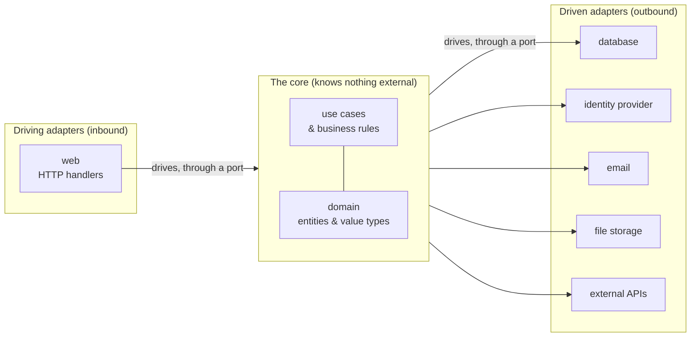
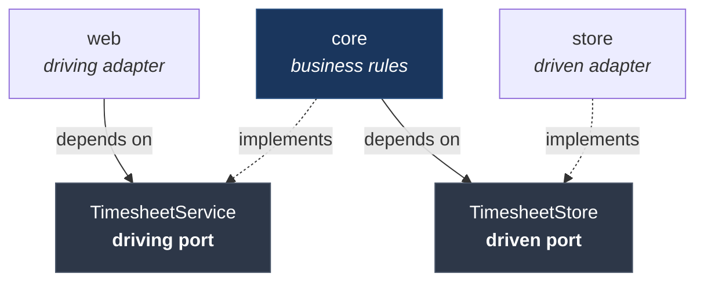
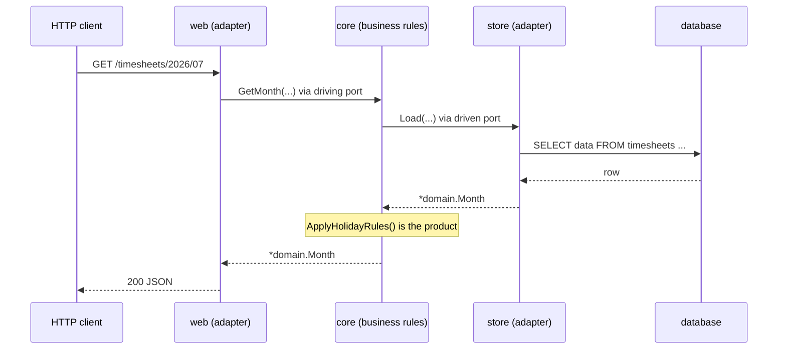

# The Core of My Go Backend Doesn't Know the Database Exists

App https://simpletimesheeet.eu <br>
Contents [contents.md](../contents.md)

---

Here is a claim that sounds absurd until you see how it's done. The center of my backend, the part that holds every business rule the product actually sells, does not know that Postgres exists. It doesn't know about Fiber, or HTTP, or AWS, or the identity provider. You could delete the entire database layer and the core would still compile. That is not an accident and it is not cleverness for its own sake. It is a specific, decades-old pattern called **Ports and Adapters**, the shape at the heart of what people call **Clean Architecture**, and it is the single design decision that gives a backend the properties every long-lived codebase wants: it is testable, swappable, framework-independent, and still readable years later.

Last post I picked Go for the backend. This post is about the architecture I poured it into, and, more importantly, about *why the pattern is worth learning* even if you never touch my code. Clean Architecture is one of those phrases that gets tattooed on codebases as a status symbol and then implemented as six empty folders. Done well it is not decoration. It is the cheapest insurance you will ever buy. Let me show you the idea, the code, and the pile of advantages that fall out of it.

## The idea, before the jargon

Picture your application as a hexagon. In the very center sits your **core**: the business logic and the domain objects, the rules that are true no matter how the app is deployed. A month of timesheets has to add up. A public holiday isn't a working day. A user can't submit someone else's hours. That logic *is* the product. Everything else, the web framework, the database, the email sender, the payment provider, is just a **detail plugged into the outside of the hexagon**.

The trick that makes it all work is one rule about which way the arrows point. **The core never depends on the details. The details depend on the core.** This is the Dependency Rule, and it is the whole of Clean Architecture in a single sentence. The database layer imports the core; the core does not import the database layer. To pull that off, the core defines the *shape of the hole* it needs, an interface, and the outside world writes a plug that fits it. Those holes are the **ports**. The plugs are the **adapters**.



Read that diagram once more with the vocabulary. Things on the **left drive the app**: a browser makes an HTTP request, so the web handler is a *driving adapter*. Things on the **right are driven by the app**: the core decides it needs to save a row, so the database code is a *driven adapter*. The core sits in the middle, oblivious to both, talking only to ports. That obliviousness is the entire value proposition, and everything below is just how Go makes it real.

## The port: a hole the core defines

A port is just an interface, and it lives in its own package with no logic and no dependencies of its own. There are two flavors. A **driving port** is what the outside world uses to push work into the core. A **driven port** is what the core uses to reach back out for something it needs.

*(All code here is illustrative, names simplified and generic, to teach the shape.)*

```go
// port/timesheet.go: the contracts, with no idea who keeps them.
package port

// Driving port: an inbound adapter calls THIS to get work done.
type TimesheetService interface {
    GetMonth(ctx context.Context, userID uuid.UUID, year, month int) (*domain.Month, error)
    SaveMonth(ctx context.Context, userID uuid.UUID, m *domain.Month) error
}

// Driven port: the core calls THIS when it needs storage. It does
// not say "Postgres". It says "something that can load and store a month".
type TimesheetStore interface {
    Load(ctx context.Context, userID uuid.UUID, year, month int) (*domain.Month, error)
    Store(ctx context.Context, userID uuid.UUID, m *domain.Month) error
}
```

Notice the driven port says nothing about SQL. It describes a *capability*, "store a month", in the core's own language. That is the hinge the whole pattern turns on.

## The driving adapter: the web, kept at arm's length

The web handler is the inbound plug. Its only job is to translate HTTP into a call on a port and translate the result back into HTTP. It holds an *interface*, so it has no idea whether a real core or a test double is behind it.

```go
// web/timesheet_handler.go: an adapter, nothing more.
type TimesheetHandler struct {
    svc port.TimesheetService // a PORT, not a concrete type
}

func (h *TimesheetHandler) getMonth(c fiber.Ctx) error {
    m, err := h.svc.GetMonth(c.Context(), userID(c), year(c), month(c))
    if err != nil {
        return handleError(c, err)
    }
    return c.JSON(m)
}
```

Swap the web framework tomorrow and you rewrite this adapter and nothing else. The core never learns the web changed underneath it.

## The core: business rules that depend on nothing

Here is the payoff. The core is the center of the hexagon. It implements the driving port, and it reaches outward only through the driven port. It imports the port and the domain. It does **not** import the database package, or a SQL driver, or anything that knows what a database is.

```go
// core/timesheet.go: the core. Notice what it does NOT import.
type timesheetService struct {
    store port.TimesheetStore // a driven PORT, not a *PostgresStore
}

// Compile-time proof the core satisfies its driving port. If it ever
// drifts, the BUILD breaks here, not production, in front of a user.
var _ port.TimesheetService = (*timesheetService)(nil)

func (s *timesheetService) GetMonth(ctx context.Context, userID uuid.UUID, year, month int) (*domain.Month, error) {
    m, err := s.store.Load(ctx, userID, year, month)
    if err != nil {
        return nil, err
    }
    m.ApplyHolidayRules() // <-- the actual product lives in here
    return m, nil
}
```

Read the struct field one more time: `store port.TimesheetStore`. The most important type in the business logic is an *interface*. The core is holding a hole. Something will plug into it at startup, but the core will never know what.

## The driven adapter: the database, kept outside

Now the plug. The store is where SQL finally appears, and it exists to satisfy the driven port. It depends on the core's contract; the core does not depend on it. The arrow points inward.

```go
// store/timesheet.go: an outbound adapter.
type PostgresStore struct {
    db *pgxpool.Pool
}

// This adapter promises to fit the core's hole. Proven at compile time.
var _ port.TimesheetStore = (*PostgresStore)(nil)

func (r *PostgresStore) Load(ctx context.Context, userID uuid.UUID, year, month int) (*domain.Month, error) {
    // the only place in the whole app that knows what a SQL row looks like
    row := r.db.QueryRow(ctx, `SELECT data FROM timesheets WHERE user_id=$1 AND year=$2 AND month=$3`, userID, year, month)
    // ... scan into *domain.Month ...
}
```

Put those two dependency arrows next to each other and you can see the inversion that names the pattern. The adapter reaches *in* toward the core's port; the core never reaches *out* toward the adapter.



Everything concrete points at a port in the middle. Nothing concrete points at anything else concrete. That is the Dependency Rule, drawn.

## The advantages, which are the whole point

Architecture is only worth its cost when it buys you something concrete. Ports and Adapters buys a lot, and here is the full list, each one a direct consequence of that single inward-pointing rule.

### 1. Your business logic is testable without the world

Because the core depends on the `TimesheetStore` *port* and not on Postgres, you can hand it a fake in a unit test: a tiny struct that satisfies the same interface and returns canned data. Every business rule gets tested in microseconds, with no database, no network, no Docker, no fixtures to spin up. This is the advantage that pays back every single day, because the tests you run a hundred times an hour become instant.

```go
// A whole "database" for a test, in five lines.
type fakeStore struct{ month *domain.Month }

func (f *fakeStore) Load(context.Context, uuid.UUID, int, int) (*domain.Month, error) { return f.month, nil }
func (f *fakeStore) Store(context.Context, uuid.UUID, *domain.Month) error            { return nil }

func TestApplyHolidayRules(t *testing.T) {
    svc := &timesheetService{store: &fakeStore{month: fixtureMonth()}}
    got, _ := svc.GetMonth(ctx, someUser, 2026, 7)
    // assert the rules, no DB, no network, no Docker
}
```

### 2. Every external detail is swappable for real

An adapter is a plug, and plugs come out. Behind one identity-provider port you can keep two adapters: a real hosted provider for production, and a local fake for development, chosen at startup. Same port, different plug. That single seam lets the entire backend run on a laptop with no external services attached, and the core cannot tell the difference. The same trick swaps Postgres for an in-memory store, a real email service for a no-op, a cloud bucket for local disk.

```go
// One port. The composition root picks which plug goes in.
type IdentityProvider interface {
    VerifyToken(ctx context.Context, raw string) (*domain.Principal, error)
}

func buildIDP(cfg Config) port.IdentityProvider {
    if cfg.LocalDev {
        return newFakeIDP()     // laptop: no external service
    }
    return newHostedIDP(cfg)    // production: the real thing
}
```

### 3. Big decisions can be deferred

Because the core only talks to ports, you can start building the product before you have chosen the database, the email provider, or the web framework. Uncle Bob's phrase for this is that these are *details*, and Clean Architecture lets you *postpone* details. You write the business rules against an interface today and plug in the real thing when the decision is actually forced, instead of welding an early guess into the heart of the app.

### 4. Frameworks become replaceable, not load-bearing

Fiber lives in one thin layer of adapters at the edge. The business logic never imports it. If Fiber's stable line moves, or a better framework appears, or gRPC has to sit next to HTTP, that is an adapter change at the boundary, not open-heart surgery on the core. The framework works for you; you do not work for it. That is exactly the independence Clean Architecture promises: the tools stay at the edge where they belong.

### 5. The boundaries let people work in parallel

Ports are contracts, and a contract is a handshake two people can build against at once. One developer writes the core behind the port; another writes the adapter that fits it; neither blocks the other, because the interface is the agreement. On a bigger team that is how you cut merge pain. Even solo, it means you can finish the business rule today and write the real database code next week without either half waiting on the other.

### 6. The shape tells the story a year later

Open the codebase cold and the architecture answers your questions before you ask them. Business rules? The core. How the app speaks HTTP? The driving adapters. Where does SQL live? The one driven adapter that holds it. Nothing is scattered, nothing hides in a framework's magic, and the dependency arrows all point one way so you can reason about change without tracing a web of coupling. For a product that has to stay alive for years, legibility is not a luxury, it is survival.

Trace one request through the finished machine and every one of those advantages is visible in the seams it crosses: the web comes in on the left, the core does the thinking in the middle, the database is reached on the right, and each hop crosses an interface you could swap or fake.



## Why Go makes this so cheap

Some languages need a framework and a pile of annotations to express this pattern. Go needs almost nothing. A port is a plain `interface`. An adapter is a struct with methods. The wiring is a few constructor calls in `main`, no dependency-injection container doing invisible reflection at startup. And the compiler proves the whole thing holds together with one line per adapter, `var _ port.TimesheetStore = (*PostgresStore)(nil)`, which fails the build the instant an adapter drifts from its contract. Clean Architecture in Go is not a heavyweight ceremony bolted on top of the language. It is just interfaces, structs, and the direction you point your imports.

## The point

Clean Architecture gets a bad name because people cargo-cult the rings and forget the one idea underneath them: **your business rules should not depend on your tools.** Ports and Adapters is the disciplined way to enforce that. The core defines the holes it needs, the outside world writes plugs that fit, and every arrow points inward. What you get back is a core you can test in microseconds, details you can swap and defer, frameworks that stay replaceable, boundaries teams can build against in parallel, and a codebase whose shape still tells the story a year from now. In Go it costs almost nothing to express, and the center of your backend gets to stay blissfully, powerfully ignorant of the database, the framework, and everything else that will inevitably change around it.

Next I open the web layer and explain a bet I made with my eyes open: choosing Fiber v3 as the framework while it was still a beta, and what living slightly ahead of the stable line actually costs.

---

*Further reading, as of writing: Alistair Cockburn's original [Hexagonal Architecture (Ports and Adapters)](https://alistair.cockburn.us/hexagonal-architecture/) and Robert C. Martin's [The Clean Architecture](https://blog.cleancoder.com/uncle-bob/2012/08/13/the-clean-architecture.html). Code shown is illustrative and generic; the production repository is private.*
