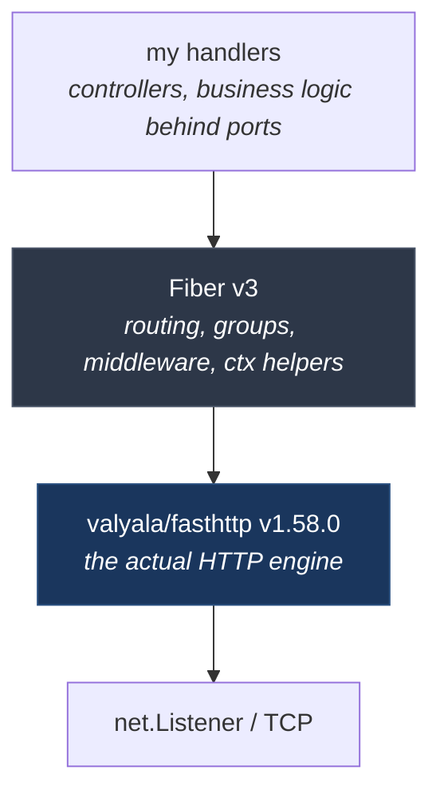
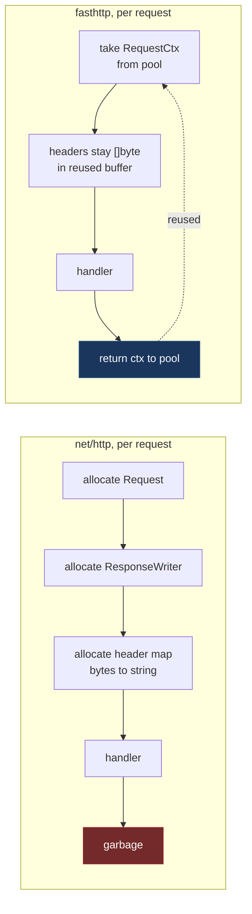

# Choosing Fiber v3 for My Go Backend, Then Benchmarking It Against Rust, Node and Python

App https://simpletimesheeet.eu <br>
Contents [contents.md](../contents.md)

---

Every Go backend starts with a decision that looks small and is not: which web framework. The standard library is right there, it is genuinely good, and choosing anything else means justifying it. I chose Fiber v3, shipped it, and it has been serving real users of a product I sell.

This post is the honest accounting of that decision: what Fiber actually is, every advantage that made me pick it, what it costs, and then the part I did not expect. I sat down to prove the performance claim with a benchmark against Rust, Node and Python, and the benchmark mostly refused to cooperate. What it taught me was more useful than the win I was fishing for.

Everything below is measured on my machine, with the commands shown, so you can disagree with the methodology instead of taking my word for it.

## What Fiber actually is

Fiber is two things stacked, and keeping them separate in your head explains almost everything about it.

The top layer is an **Express-style API**. Routes, groups, middleware, handlers that return an `error`. If you have written Node, the shape is instantly familiar.

The bottom layer is **fasthttp**, a complete replacement for Go's standard `net/http` server written by Aliaksandr Valialkin. This is the interesting half. fasthttp is not a wrapper around the standard library, it is a parallel implementation with different rules, and every advantage and every sharp edge in this post traces back to it.



The pitch for fasthttp is specific. From its own README: the server is *"up to 6 times faster than net/http"*. It gets there by refusing to do the thing `net/http` does on every single request, which is allocate a fresh world.

Under `net/http`, each request builds a new `*http.Request`, a new `ResponseWriter`, and stores headers in a `map[string][]string`, which means allocating a map, hashing keys, and converting bytes off the wire into `string` values. Under fasthttp, a `RequestCtx` is taken from a pool and handed back afterwards, headers live as `[]byte` slices into a reused buffer, and reading one hands you a view instead of a copy.



That single design choice, reuse instead of allocate, is the entire performance story. Hold on to it, because later it is also the entire *gotcha* story.

## Why I chose it, the full list

Performance was on the list, but it was genuinely not the top of it. Here is the honest ordering.

### 1. The API is boring in the best way

A route is a route. A group is a group. Middleware is a function. There is no code generation step, no struct tags controlling routing, no reflection-driven magic to debug at 2am. This is the real router from my backend, and you can read it cold:

*(Code throughout is illustrative and simplified from the production repo, which is private.)*

```go
func RegisterRoutes(app *fiber.App, deps RouteDependencies) {
    app.Get("/health", healthcheck.NewHealthChecker())

    apiGroup := app.Group("/api/")
    apiGroup.Use(middleware.CORSMiddleware(viper.GetString("server.cors.allowOrigins")))

    apiV1Group := apiGroup.Group("v1/")
    apiV1Group.Use(middleware.AuthMiddleware(deps.IDPClient, deps.UserResolver, authorizedParties))

    apiV1Group.Get("/users/current", deps.UserController.GetCurrentUser)
    apiV1Group.Get("/users/:id/timesheets/:year/:month", deps.TimesheetController.GetTimesheetMonth)
    apiV1Group.Put("/users/:id/timesheets/:year/:month", deps.TimesheetController.SaveTimesheetMonth)
}
```

Six months later that still reads like a table of contents for the API.

### 2. Groups make the auth boundary a structural fact

This is the advantage I use hardest. Authentication is not a decision each handler makes, it is a property of *which group a route is registered in*. Three groups, three different security postures, visible in one screen:

```go
// Authenticated: browser app traffic. Auth middleware applies to everything below.
apiV1Group := apiGroup.Group("v1/")
apiV1Group.Use(middleware.AuthMiddleware(...))

// Webhooks: no user session exists. Stripe and the IdP verify by signature instead.
webhookGroup := apiGroup.Group("webhooks/")
webhookGroup.Post("/stripe/billing", deps.BillingController.HandleStripeWebhook)

// Public: the marketing site and signed-out flows.
publicGroup := apiGroup.Group("public/")
publicGroup.Post("/consent", deps.ConsentController.RecordConsent)
```

You cannot accidentally forget auth on a new user route, because registering it under `apiV1Group` *is* how it gets auth. Forgetting would mean putting it in the wrong group, which is a visible mistake in review rather than an invisible one.

### 3. Middleware that composes without ceremony

A Fiber middleware is a handler that decides whether to call the next one. My auth middleware verifies the JWT, resolves the user, stashes it on the context, and continues, or it returns an error and the chain stops.

```go
func AuthMiddleware(idp IdentityProviderClient, users UserResolver, parties []string) fiber.Handler {
    return func(c fiber.Ctx) error {
        raw := c.Get("Authorization")            // header read, no allocation
        principal, err := idp.VerifyToken(c.Context(), raw, parties)
        if err != nil {
            return apperr.Unauthorized("invalid token")
        }
        user, err := users.Resolve(c.Context(), principal)
        if err != nil {
            return err
        }
        c.Locals("user", user)                   // hand it downstream
        return c.Next()                          // continue the chain
    }
}
```

### 4. A dev-mode swap that costs one branch

Because middleware is just a value, the entire authentication layer can be replaced at startup. On a laptop with no identity provider running, a dev middleware injects a fixed user and everything downstream is unchanged:

```go
if !IsFeatureEnabled("auth") {
    log.Warn("Authorization middleware disabled, using dev user from config")
    apiV1Group.Use(middleware.DevAuthMiddleware(viper.GetString("idp.auth.devUserID")))
} else {
    apiV1Group.Use(middleware.AuthMiddleware(deps.IDPClient, deps.UserResolver, authorizedParties))
}
```

That is the same swappability idea from [the previous post on Ports and Adapters](06-ports-and-adapters-clean-architecture.md), applied at the edge instead of the core.

### 5. Errors return instead of disappearing

A Fiber handler returns `error`. That is a small signature decision with a large consequence: error handling is a normal Go return path, not a side effect performed on a `ResponseWriter`. One central handler turns domain errors into status codes, and no handler ever writes a status by hand.

```go
func (c *TimesheetControllerImpl) GetTimesheetMonth(ctx fiber.Ctx) error {
    month, err := c.service.GetMonth(ctx.Context(), userID(ctx), year(ctx), mon(ctx))
    if err != nil {
        return err          // one place decides what this means over HTTP
    }
    return ctx.JSON(month)
}
```

### 6. The batteries I actually wanted are included

Health checks, CORS, body limits, and request-size controls ship with the framework. `app.Get("/health", healthcheck.NewHealthChecker())` is the whole health endpoint, and the load balancer and container orchestrator both consume it.

### 7. It stays at the edge, so the bet is contained

This is the argument that made every cost below acceptable, and it is worth being explicit about. Fiber appears in my controllers and middleware and nowhere else. The core business logic imports no web framework. If Fiber moves in a direction I dislike, or a better framework appears, the blast radius is one thin layer of adapters. I did not bet the product on Fiber. I bet one replaceable layer on it.

## The benchmark, and the wall I hit

Now the part I actually wanted to write. The claim is that fasthttp is dramatically faster. Is it, in a shape resembling my app, compared to other languages?

I wrote the same trivial JSON endpoint five times, in Go on Fiber, Go on `net/http`, Rust on axum, Node, and Python. Every server returns byte-identical output:

```json
{"message":"hello, world","id":42}
```

The Fiber server pins the exact versions my production backend uses, `fiber v3.0.0-beta.4` on `fasthttp v1.58.0`. Rust is a release build with `lto = true` and `codegen-units = 1`. I wrote a small concurrent Go load generator with a warmup phase and latency percentiles, and ran each server alone so nothing competed for CPU.

**Environment.** Apple M4 Pro, 12 cores, macOS. Go 1.26.4, Rust 1.92.0 with axum 0.8.9, Node v25.8.1, Python 3.14.6. 128 connections, 10 second measured run, 3 second warmup discarded, over loopback.

Here is what came back.

| Stack | Requests/sec | p50 | p95 | p99 | Errors |
|---|---:|---:|---:|---:|---:|
| Rust, axum | 122,757 | 0.99 ms | 1.70 ms | 2.68 ms | 0 |
| **Go, Fiber (fasthttp)** | **118,123** | 0.98 ms | 2.13 ms | 3.23 ms | 0 |
| Go, net/http | 116,881 | 0.93 ms | 2.50 ms | 3.68 ms | 0 |
| Python, asyncio | 106,662 | 1.18 ms | 1.48 ms | 2.34 ms | 0 |
| Node, http | 65,664 | 1.94 ms | 2.09 ms | 2.50 ms | 0 |

Read that table and the obvious conclusion is that Rust wins narrowly, Fiber is close behind, and Go beats Node comfortably. That conclusion is **wrong**, or at least unsupported, and here is how I know.

Look at the top four. Rust, Fiber, `net/http` and *Python* all land between 106k and 123k. Python has no business being within 15% of a tuned Rust release build. When a benchmark tells you something that implausible, the benchmark is measuring itself.

So I tested that directly. First, I raised concurrency against Fiber alone:

| Connections | Requests/sec |
|---|---:|
| 32 | 106,792 |
| 64 | 115,746 |
| 128 | 118,556 |
| 256 | 119,008 |

Throughput flatlines around 119k no matter how hard I push. Then the decisive test, two independent load generators hammering Fiber at the same time:

```
loadgen A:  60,394 req/s
loadgen B:  60,252 req/s
AGGREGATE: 120,646 req/s
```

Two clients produced the same total as one. That is the signature of a hard ceiling that is not the server. The bottleneck is the loopback interface and my Go load generator's own client stack, both running on the same laptop as the thing they are measuring. Every server except Node was fast enough to sit idle waiting for work.

**So the real finding is this: I could not saturate any of these frameworks on my own machine.** The only measurement in that table I trust is the one that is clearly separated, Node at roughly half the throughput of the others, and even that is a floor rather than a limit.

## Measuring the framework instead of my laptop

To compare frameworks you have to delete the network. So I benchmarked the request path in process with Go's own benchmark tooling, counting nanoseconds and allocations per operation, `net/http` versus fasthttp directly.

```
BenchmarkNetHTTP-12       5560827    648.2 ns/op    1008 B/op    9 allocs/op
BenchmarkFastHTTP-12      8421253    427.2 ns/op    1641 B/op    6 allocs/op
```

Now something real appears. fasthttp serves the same JSON in **427 ns against 648 ns**, about **1.5 times faster**, with **6 allocations instead of 9**. The allocation count is the mechanism from the diagram, made visible: fewer trips to the allocator, less for the garbage collector to sweep later.

Two honest caveats, because this is exactly where benchmarks get oversold.

First, **1.5x is not the advertised 6x.** My test encodes JSON on both sides, and that shared work dilutes the difference. It also constructs a fresh `RequestCtx` each iteration, which is why fasthttp reports *more* bytes per operation despite fewer allocations. In production that context comes from a pool and is reused, which is precisely the win my microbenchmark fails to capture. The real number for a given app is somewhere between mine and theirs, and it depends entirely on the app.

Second, the header advantage is real but small in isolation:

```
BenchmarkNetHTTPHeaderRead-12     25.82 ns/op    0 allocs/op   // map lookup, returns string
BenchmarkFastHTTPHeaderRead-12    20.82 ns/op    0 allocs/op   // Peek, returns []byte view
```

Five nanoseconds. Per header. You need a great many headers before that pays for a weekend of debugging.

Footprint is the one place the languages separate cleanly, measured as resident memory on the same idle servers:

| Stack | Idle RSS | Binary |
|---|---:|---:|
| Rust, axum | 8.4 MB | 0.8 MB |
| Python, asyncio | 24.0 MB | n/a |
| Go, net/http | 26.3 MB | 7.8 MB |
| Go, Fiber | 28.8 MB | 11.5 MB |
| Node, http | 99.1 MB | n/a |

Rust is in a different class, and Node costs about 3.5 times Fiber's memory before serving a single user. That gap is real, it is stable, and unlike throughput it does not depend on my load generator.

## What the choice actually costs

Now the bill. Leaving `net/http` is not free and I would be lying by omission if I stopped at the advantages. Note that almost every item here is a fasthttp cost rather than a Fiber one, which is the point: you are not really choosing a router, you are choosing an HTTP engine.

**Third-party middleware assumes net/http, and fasthttp is not net/http.** This is the deepest cost by a distance. The enormous Go ecosystem of middleware written against `http.Handler` does not simply drop in. There is an adaptor, but every time you reach for a library the first question is compatibility, and sometimes the answer is that you write it yourself.

**No HTTP/2.** fasthttp does not support it. In my setup that is fine because nginx terminates TLS and speaks HTTP/2 to the browser, then plain HTTP/1.1 over loopback to the backend, which is the fast path anyway. But it is a constraint you inherit, and if you needed gRPC on the same port you would be stuck.

**And the buffer that reuses memory has to be sized up front.** This is my favourite gotcha because it is the pooling design biting back. Reused buffers are fixed-size buffers, and a request whose headers do not fit gets rejected. Modern JWTs from a hosted identity provider are large. Here is the real configuration line, comment included:

```go
func Server() *fiber.App {
    return fiber.New(fiber.Config{
        BodyLimit:      utils.MaxAvatarSize + 1024*1024,
        ReadBufferSize: 64 * 1024, // 64 KB, large enough for Clerk JWTs + other headers
    })
}
```

That 64 KB is not a number I guessed. It is a number I arrived at, and the trade is explicit in the framework's own design: you accept a hand-sized buffer knob in exchange for not allocating a new one per request.

**And the version I run is still pre-1.0.** Here is the line from `go.mod`, unedited:

```
github.com/gofiber/fiber/v3 v3.0.0-beta.4
```

That was not an accident either. The v3 API is the one I wanted to write against, so I took it early and accepted that it is allowed to move under me. It already has once: in v2 a handler took `*fiber.Ctx`, a pointer, and in v3 it takes `fiber.Ctx`, a value, which is a signature every controller in the codebase carries.

```go
// v2: func(c *fiber.Ctx) error
// v3: func(c fiber.Ctx) error
func (c *UserControllerImpl) GetCurrentUser(ctx fiber.Ctx) error {
```

I list this cost last on purpose. It is the one people react to loudest and the one advantage 7 contains most cheaply: a churning API hurts in proportion to how much of your codebase touches it, and mine touches one thin edge layer. The middleware ecosystem gap above is permanent. This one is a mechanical afternoon.

## The honest verdict

I went looking for a benchmark that would justify the choice on speed, and I did not really get one. What I got instead was better information.

On my laptop I could not push any of these frameworks to their limit, because loopback and my own client gave out first. In a fair in-process test fasthttp is about **1.5x faster per request with a third fewer allocations**, which is a genuine engineering win and nowhere near the headline number. And at the scale a timesheet product operates, both are so far past sufficient that the difference is invisible. A user saving a month of hours cannot perceive 200 nanoseconds.

Which lands almost exactly where fasthttp's own README lands, in a line I think everyone quoting the 6x figure should be made to read aloud:

> "Unless your server/client needs to handle thousands of small to medium requests per second and needs consistent low millisecond response time fasthttp might not be for you. For most cases `net/http` is much better."

The library author is telling you not to choose his library for speed you do not need. I chose it anyway, and I would again, because **speed was never the deciding advantage**. The deciding advantages were the ones in the list above: a router I can read cold, groups that make the auth boundary structural, middleware that swaps in one branch for local development, errors that return like normal Go, and a framework confined to a layer thin enough that replacing it is an afternoon rather than a rewrite.

The performance is a bonus I have not needed to cash yet. The costs are real and ongoing, and I pay them in exchange for an edge layer that reads the way I want it to read. That is the trade, stated plainly, with the numbers attached.

Next I go one layer down, into the database, and explain a decision that raises more eyebrows than anything in this post: storing an entire month of timesheets as a single JSONB column in Postgres, and why the relational purist objection is mostly wrong here.

---

*Benchmarks were run on an Apple M4 Pro, 12 cores, all servers on loopback, each measured alone. The load generator, the five servers and the in-process benchmark are trivially reproducible from the code shown. Numbers describe this machine under this synthetic workload and should not be read as production capacity. Code is illustrative and simplified; the production repository is private. Further reading: [fasthttp](https://github.com/valyala/fasthttp), [Fiber](https://gofiber.io/), and the [TechEmpower Framework Benchmarks](https://www.techempower.com/benchmarks/) for cross-language comparisons run properly, on dedicated hardware, by people who do this for a living.*
