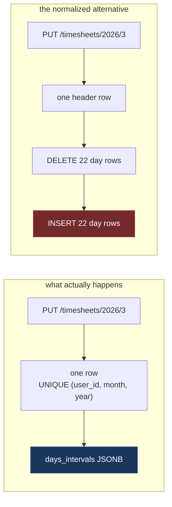
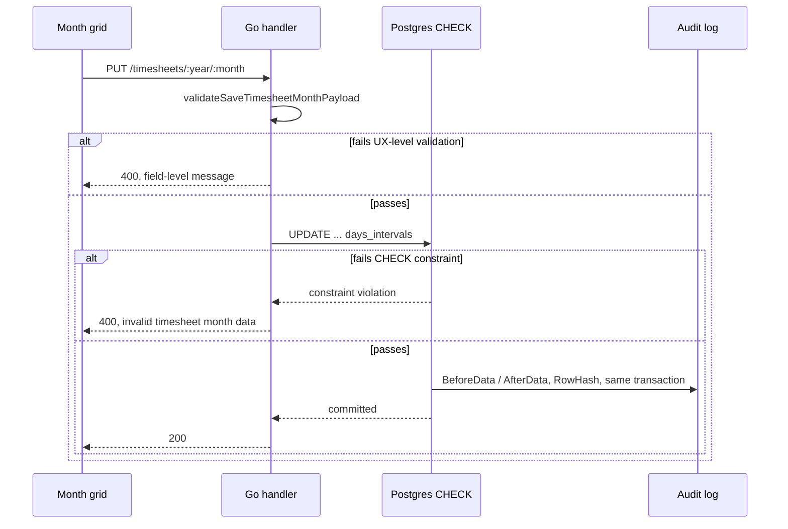

# Postgres + JSONB: A Whole Month of Timesheets in One Column

App https://simpletimesheeet.eu <br>
Contents [contents.md](../contents.md)

---

A timesheet day has a date, a start time, an end time, a break, and a couple of flags. That is a thing with attributes. Things with attributes get rows. Every instinct trained by fifteen years of relational modelling says: create a `timesheet_days` table, put a foreign key on it, go to lunch.

I did not do that. A month of timesheets lives in one `JSONB` column on one row, and that decision has been in production serving paying users since the first release.

This post is the defence of it, and then the bill. I benchmarked both models side by side in a real Postgres 17 storage, reads, writes, and the analytical query the normalized model is supposed to win. One of the results is the opposite of what I expected and it is the most useful number in the post, so it stays in.

There is also a twist that most JSONB posts skip: **the column is not schemaless.** The database validates every day inside that array, and it is stricter than most normalized tables I have worked on.

## The objection, stated fairly

Before defending the choice, let me put the case against it properly, because it is a good case.

Storing a collection as JSON inside a row loses you things a relational database exists to give you. You cannot put a foreign key on an element. You cannot lock one day. You cannot ask "who worked on the 12th" without unpacking every array in the table. You cannot add a constraint to a field with `ALTER TABLE`. You trade a schema the database understands for a blob it merely stores.

All of that is true. The question is not whether you lose those things. The question is whether you were using them.

## The unit of work is a month

Here is the whole argument in one line, and everything else follows from it: **a month is my aggregate.** Not a day.

Look at where a timesheet is touched. The API has exactly one write endpoint for timesheets, and it takes a month:

```go
apiV1Group.Get("/users/:id/timesheets/:year/:month", deps.TimesheetController.GetTimesheetMonth)
apiV1Group.Put("/users/:id/timesheets/:year/:month", deps.TimesheetController.SaveTimesheetMonth)
```

*(Code throughout is illustrative and simplified from the production repo, which is private.)*

The UI is a grid of a month. The user fills in a pattern, corrects a few days, and hits save once. The validation rules are month-scoped: no duplicate day numbers, no day 31 in a 30-day month, at least one meaningful entry. The audit trail records a month. There is no screen, no endpoint, and no rule anywhere in the product that operates on a single day in isolation.

So the transaction boundary is a month. And when the transaction boundary is a month, giving days their own rows means the database is storing a fan-out that **no part of the product** ever reads or writes independently:



The right-hand column is not wrong. It is just paying for a granularity nobody asked for.

One correction to that sentence before it does any more work, because the benchmarks later in this post will not let it stand unqualified. *The product* never touches a day on its own. **The database does.** The `CHECK` constraint in the next section unpacks the array and inspects all twenty-two days individually on every single save. So this design does not eliminate the per-day work. It relocates it: out of row headers and index entries, and into CPU at write time. That turns out to be a good trade, but it is a trade, and I put a number on it in [Writing a month](#writing-a-month), where the normalized model wins.

The Go side reflects this exactly. The days are a *value* of the timesheet, implemented as a type that knows how to become a column:

```go
type DayInterval struct {
    DayNumber       int     `json:"day_number"`
    StartHour       *string `json:"start_hour"`
    EndHour         *string `json:"end_hour"`
    BreakMinutes    int     `json:"break_minutes"`
    IsPublicHoliday bool    `json:"is_public_holiday"`
    IsTimeOff       bool    `json:"is_time_off"`
}

type DayIntervalList []*DayInterval

func (d DayIntervalList) Value() (driver.Value, error) { return json.Marshal(d) }

func (d *DayIntervalList) Scan(value any) error {
    bytes, ok := value.([]byte)
    if !ok {
        return fmt.Errorf("failed to unmarshal JSONB value: %v", value)
    }
    return json.Unmarshal(bytes, &d)
}

type Timesheet struct {
    ID            uuid.UUID       `gorm:"type:uuid;primaryKey"`
    UserID        uuid.UUID       `gorm:"type:uuid;not null"`
    Month         int             `gorm:"not null"`
    Year          int             `gorm:"not null"`
    DaysInMonth   int             `gorm:"not null"`
    DaysIntervals DayIntervalList `gorm:"type:jsonb;default:'[]'"`
    TotalHours    int             `gorm:"not null"`
}
```

Two methods, `Value` and `Scan`, and the whole month round-trips. There is no ORM relationship to configure, no eager-loading decision, no N+1 waiting to happen.

## The principle, and why the general rule does not apply here

The general relational rule is not wrong, so it is worth stating plainly before I break it: a collection becomes a child table with a foreign key, because most collections have members that live independent lives outside their parent. An order's line items get refunded one at a time. A blog's comments get moderated one at a time. A playlist's tracks get reordered without anyone touching the album. Normalizing those collections is not dogma, it is the model that matches how they are actually used.

A day inside a timesheet month has none of that independence, and that gap is the entire justification for what follows. Nothing approves a day on its own, comments on a day, attaches a file to a day, or queries across days for a report. The general rule optimizes for a capability, independent access to a member of the collection, that this product has never once needed. Applying it anyway would mean paying that rule's costs, the join, the migration surface, a 23-byte row header on every one of 264,000 rows, for a capability that sits unused.

This is the same move system designers reach for under the name **aggregate boundary**: size the consistency boundary to what you actually enforce transactionally, not to what the data looks like on a whiteboard. Here that boundary is exactly one month, so I sized the storage to match it: one row, one write, one lock, one audit entry. The general rule and this one are not in conflict. They are the same rule, applied to different data. Rows for an order's line items, because they have independent life. One JSONB value for a timesheet's days, because they do not.

What breaking the textbook default buys me, specifically, in this product:

- **Atomicity for free.** A month save cannot land half-written. There is no multi-statement transaction to get wrong, because there is only one statement.
- **No N+1, ever.** The grid renders from one row. There is no eager-loading decision to make, and therefore none to get wrong six months from now.
- **Zero-migration growth.** The holiday-tooltip fields two sections down are the proof.
- **The audit trail matches the boundary.** Covered in [the second-order win](#the-second-order-win-i-did-not-plan) below.
- **A concurrency model that matches what the user experiences.** The grid is one form with one save button. A single-row lock is the same unit of "did my save go through" the user already carries in their head.

And what it costs, which the general rule would have protected me from, shows up later in this post in full: no foreign key can reach a day, two tabs racing means last-write-wins on the whole month, and the validator that keeps the column honest turns out to be the most expensive thing I do to this table. I own all three on purpose, because none of them are costs this product actually pays.

## The part people do not expect: the column has a schema

This is where I part company with most "just use JSONB" advice. Choosing JSONB is usually presented as trading integrity for flexibility. I did not make that trade. I moved integrity from column definitions into a predicate, and the predicate lives in the database.

The table has an ordinary-looking `CHECK`:

```sql
CREATE TABLE timesheet.timesheet
(
    id             UUID PRIMARY KEY,
    user_id        UUID     NOT NULL REFERENCES timesheet.timesheet_users (id) ON DELETE CASCADE,
    month          SMALLINT NOT NULL CHECK (month BETWEEN 1 AND 12),
    year           SMALLINT NOT NULL CHECK (year >= 2000),
    days_in_month  SMALLINT NOT NULL CHECK (days_in_month BETWEEN 28 AND 31),
    total_hours    INTEGER  NOT NULL DEFAULT 0 CHECK (total_hours BETWEEN 0 AND 744),
    days_intervals JSONB    NOT NULL DEFAULT '[]',

    CHECK (days_in_month = timesheet.days_in_month_for(year, month)),
    CHECK (timesheet.is_valid_timesheet_days_intervals(days_intervals, days_in_month)),
    UNIQUE (user_id, month, year)
);
```

Those last two lines are the interesting ones, and they compose.

The first calls an `IMMUTABLE` function so a row cannot lie about the calendar:

```sql
CREATE OR REPLACE FUNCTION timesheet.days_in_month_for(p_year SMALLINT, p_month SMALLINT)
    RETURNS SMALLINT LANGUAGE SQL IMMUTABLE AS
$$
SELECT EXTRACT(DAY FROM (make_date(p_year::INTEGER, p_month::INTEGER, 1)
                             + INTERVAL '1 month - 1 day'))::SMALLINT;
$$;
```

February 2027 has 28 days whether the application believes it or not. Try to insert a row claiming otherwise and Postgres refuses:

```
ERROR:  new row for relation "timesheet" violates check constraint "timesheet_check"
```

The second constraint then *consumes that verified value* as the upper bound for everything inside the JSON. `days_in_month` cannot be wrong, so "day 31 is out of range for April" is a fact the database can establish on its own.

The validator itself is about a hundred lines of SQL in three passes. Pass one checks shape: every element must be an object carrying six required keys with the right JSON types.

```sql
shape_check AS (
    SELECT value,
           jsonb_typeof(value) = 'object'
               AND value ? 'day_number'
               AND value ? 'start_hour'
               AND value ? 'end_hour'
               AND value ? 'break_minutes'
               AND value ? 'is_public_holiday'
               AND value ? 'is_time_off'
               AND jsonb_typeof(value->'day_number') = 'number'
               AND COALESCE(jsonb_typeof(value->'start_hour') IN ('string', 'null'), FALSE)
               AND COALESCE(jsonb_typeof(value->'end_hour')   IN ('string', 'null'), FALSE)
               AND jsonb_typeof(value->'break_minutes') = 'number'
               AND jsonb_typeof(value->'is_public_holiday') = 'boolean'
               AND jsonb_typeof(value->'is_time_off') = 'boolean' AS is_shape_valid
    FROM entries
)
```

Pass two normalizes each element into typed columns. Pass three is a wall of predicates, and this is the part that would be a pile of `ALTER TABLE ... ADD CONSTRAINT` statements in the normalized world:

```sql
WHERE day_number < 1
   OR day_number > p_days_in_month
   OR break_minutes < 0
   OR break_minutes > 480
   OR (is_public_holiday AND is_time_off)
   OR ((start_hour IS NULL) <> (end_hour IS NULL))
   OR (start_hour IS NOT NULL AND start_hour !~ '^(?:[01]\d|2[0-3]):[0-5]\d$')
   OR (end_hour   IS NOT NULL AND end_hour   !~ '^(?:[01]\d|2[0-3]):[0-5]\d$')
   OR ((start_hour IS NULL AND end_hour IS NULL) AND break_minutes <> 0)
   OR ((is_public_holiday OR is_time_off)
           AND (start_hour IS NOT NULL OR end_hour IS NOT NULL OR break_minutes <> 0))
   OR (start_hour IS NOT NULL
           AND end_hour IS NOT NULL
           AND CASE
                   WHEN start_hour ~ '^(?:[01]\d|2[0-3]):[0-5]\d$'
                       AND end_hour ~ '^(?:[01]\d|2[0-3]):[0-5]\d$'
                       THEN end_hour::TIME < start_hour::TIME
                       OR break_minutes > EXTRACT(EPOCH FROM (end_hour::TIME - start_hour::TIME)) / 60
                   ELSE FALSE
               END)
```

Plus a `GROUP BY day_number HAVING COUNT(*) > 1` to reject the same day appearing twice.

Read that list and notice what it contains: a **regex for `HH:MM`**, a **cross-field rule** (a public holiday may not also be time off), a **conditional rule** (a holiday or time-off day may not carry hours or a break), and an **arithmetic rule** (your break cannot be longer than your shift). Most normalized schemas I have seen would enforce two of those in the database and the rest in application code, or nowhere.

Here is what it looks like when you try to get nonsense in. Every one of these is rejected by Postgres, with no application running:

| Attempt | Result |
|---|---|
| Day 31 in April | rejected |
| The same day number twice | rejected |
| `"start_hour": "9am"` | rejected |
| Clocking out at 09:00 having clocked in at 17:00 | rejected |
| A 3-hour break inside a 2-hour shift | rejected |
| A day that is both a public holiday and time off | rejected |
| A public holiday that somehow has working hours | rejected |
| `"break_minutes": "60"` as a string | rejected |
| February 2027 with 31 days | rejected |

That is not a schemaless column. That is a schema written as a predicate instead of as a `CREATE TABLE`.

## What the shape bought me, with a receipt

The validator requires six keys. It does not forbid a seventh.

When I added public-holiday tooltips, showing the holiday's name and its local-language name on the day cell, the day object needed two new fields. The entire storage-layer change was this:

```go
HolidayName      *string `json:"holiday_name,omitempty"`
HolidayLocalName *string `json:"holiday_local_name,omitempty"`
```

No migration. No `ALTER TABLE`. No lock on a growing table. No backfill for historical rows, which simply do not carry the keys and do not need to. Deploy the binary and the new field is being stored.

In the normalized model that is two `ALTER TABLE ADD COLUMN` statements against a table that, at the volumes in my benchmark, holds 264,000 rows. Postgres 17 makes adding a nullable column cheap, so this is not a catastrophe, but it is still a migration, still a review, still a deploy ordering question. Here it was a struct field. The full story of wiring those tooltips through the stack is post 13.

## The measurements

Enough argument. I built both models in the same Postgres 17 and put the same data in each: 500 users, 24 months apiece, 22 worked days per month. That is **12,000 timesheets** and, in the normalized model, **264,000 day rows**. The normalized day rows are expanded directly from the JSONB, so the two schemas cannot disagree about the data.

The normalized schema is not a strawman. It has the same `CHECK` rules as real column constraints, a `UNIQUE (timesheet_id, day_number)`, and an index on `day_number` for the analytical query.

**Environment.** Postgres 17.10 in Docker on an Apple M4 Pro. Timings are taken server-side with `clock_timestamp()` around `plpgsql` loops, so client round-trip is not in the numbers.

### Storage

First the payload. A 22-day month is roughly 2.9 KB of JSON text. Here is what Postgres actually stores:

| | JSON text | stored in the row | TOAST table |
|---|---:|---:|---:|
| Uniform days (every day identical) | 2,961 B | **261 B** | 0 bytes |
| Varied days (different hours, breaks, time off) | 2,941 B | **432 B** | 0 bytes |

I ran the second row on purpose. My first seed gave every day the same hours, which compresses unrealistically well, and a benchmark that flatters itself is worthless. I learned that the hard way in [the last post](07-choosing-fiber-v3.md). With genuinely varied data it is 432 bytes, still a **6.8x** reduction from the text form, because every object repeats the same six keys and PGLZ eats repetition for breakfast.

The `TOAST` column matters too. I expected a ~3 KB value to be pushed out of line, since the threshold is around 2 KB. It never was. Compression got it under the limit first, so the whole month lives in the main heap page and reading it costs no extra fetch. The toast table is empty.

Now the tables, same 12,000 months in each:

| Model | Total size |
|---|---:|
| JSONB month, uniform days | 5.4 MB |
| **JSONB month, varied days** | **7.4 MB** |
| Normalized, UUID primary keys | 51 MB |
| Normalized, BIGINT identity keys | 42 MB |

I measured the normalized model twice as well, because using UUID keys for day rows would have been my own schema's convention and it would also have been an unfair handicap. Even against the fairest version, `BIGINT GENERATED ALWAYS AS IDENTITY`, the JSONB model is **5.7x smaller**.

The reason is not the JSON. It is that 264,000 rows cost 264,000 row headers, 264,000 index entries in the primary key, and another 264,000 in the unique constraint. Postgres charges 23 bytes of header per row before your data shows up. A month of days as one value pays that overhead once instead of twenty-two times.

### Reading a month

The operation the product actually performs, 20,000 times:

| Model | Per read |
|---|---:|
| JSONB month (uniform) | **2.9 µs** |
| JSONB month (varied) | **3.0 µs** |
| Normalized, header joined to day rows | 7.8 µs |

**2.6x faster**, and the plans say exactly why:

```
-- JSONB
Index Scan using timesheet_user_id_month_year_key on timesheet (rows=1)
  Buffers: shared hit=2 read=3
Execution Time: 0.015 ms

-- normalized
Sort (rows=22)
  ->  Nested Loop
        ->  Index Scan using timesheet_user_id_month_year_key on timesheet (rows=1)
        ->  Bitmap Heap Scan on timesheet_days (rows=22)
  Buffers: shared hit=12
Execution Time: 0.029 ms
```

One index scan returning one row, against an index scan plus a bitmap heap scan plus a nested loop plus a sort to get the days back in day order. The JSONB array is already in order because it was written in order.

### Writing a month

Here is the result I did not want.

| Model | Per write |
|---|---:|
| JSONB: one `UPDATE` | 379.0 µs |
| Normalized: delete 22, insert 22, update header | **212.8 µs** |

**The JSONB model is 1.8x slower on write.** One statement loses to twenty-four.

That is worth sitting with for a second, because it is the exact opposite of the intuition that "one row must be cheaper than twenty-two rows."

So I isolated it. Same update, run with the validator installed and then with it dropped:

| | Per `UPDATE` |
|---|---:|
| With the `CHECK` validator | 374.9 µs |
| Without the `CHECK` validator | **33.3 µs** |

There it is. **The validator is 91% of the write cost**, and it makes writes **11.3x** more expensive.

This is the honest price of the section I was pleased with earlier, and it is the relocated fan-out arriving on the bill. Every save re-runs `jsonb_array_elements` over the whole month, re-checks six key types per day, runs two regexes per day, does a `GROUP BY` for duplicates, and evaluates a dozen predicates, for all 22 days, even when the user changed one of them. A normalized model validates per row, so a single changed day validates one day.

Strip the validator and the shape argument comes back intact: **33.3 µs for one `UPDATE` against 212.8 µs for delete-22-insert-22**, which is the 6.4x advantage the diagram earlier in this post implies. The fan-out really is expensive to write. I just chose to buy something more expensive with the money I saved.

### What this costs at my actual scale

Microseconds do not mean anything until you multiply them by real traffic, so here is the back-of-envelope version. Say "a handful of saves per user per month" is three, and use the same 500 users this benchmark modeled: that is 1,500 saves a month, product-wide. At 379 µs each, the validator runs for roughly **0.57 seconds of total database CPU time** across every user, every month. Strip it out and that number drops to about 50 milliseconds. The entire "11.3x more expensive" tax, at the scale I actually operate at, is the difference between two numbers neither I nor Postgres will ever notice.

That is the real argument for keeping the constraint: not that 379 µs is small, but that 379 µs times my actual traffic is still nothing. The math only turns against me if a single save starts touching thousands of days instead of thirty-one, and this product has no path to that.

I am keeping the constraint. At 379 µs, a month save is still far below the point where anyone notices, my write volume is a handful of saves per user per month, and the thing it buys me is that no bug in any layer above can put a malformed month in the database. But I am no longer allowed to say the JSONB model is faster. It is faster to read, smaller to store, and *slower to write*, and the slowness is self-inflicted and deliberate.

### The query the normalized model wins

Finally, the one I owe the relational purist. Across all 12,000 months, how many worked days fall on the 12th?

| Model | Time | Buffers |
|---|---:|---:|
| JSONB, unnest every array | 45.2 ms | 1,000 |
| Normalized, index on `day_number` | **4.7 ms** | 3,638 |

**9.6x slower.** And a plain aggregate, total break minutes booked across every day in the system, is **48.0 ms against 9.4 ms**, about 5x.

Note the buffer counts, because they are the interesting part. The JSONB query touches **3.6x fewer pages** and is still ten times slower. It is not I/O-bound, it is CPU-bound: parsing 12,000 JSONB arrays into 264,000 elements and casting `->> 'day_number'` to `int` on every one. The normalized model reads much more from disk and still wins, because reading a `SMALLINT` costs nothing.

If cross-day analytics were a feature of my product, this table would end the argument and I would normalize. It is not a feature of my product. I have never run that query outside this benchmark.

## What it costs, without the spin

The write penalty above is one item on the bill. Here is the rest.

**No foreign key can point at a day.** If days needed to be referenced by an approval, a comment, or an attachment, the model breaks immediately. Nothing references a day.

**The month is the concurrency unit.** Two tabs editing the same month means last-write-wins on the whole month, not a per-day merge. The repository handles the *insert* race explicitly, and that code exists precisely because the unique key is `(user_id, year, month)`:

```go
case errors.Is(lookupErr, gorm.ErrRecordNotFound):
    t.ID = uuid.New()
    createErr := tx.Create(t).Error
    if createErr == nil { /* ... */ }
    if !apperr.IsUniqueConstraintErr(createErr) {
        return createErr
    }
    // Race: another tx inserted the same (user_id, year, month) between
    // our SELECT and INSERT. Refetch that row and fall through to update.
```

**And the admission that should decide how much you trust the rest of this post: there is no GIN index on that column.** None. I checked every migration in the repo to be sure before writing this sentence. The standard advice when you store JSONB is to add a GIN index so you can query inside it. I never added one, because in the entire product there is not one query that looks inside `days_intervals`. Every read is:

```sql
WHERE user_id = ? AND year = ? AND month = ?
```

which is the `UNIQUE (user_id, month, year)` btree, and it returns the days as a side effect of returning the row. An index I would never use is an index I refuse to pay for on every write. If that changes, the escape hatch is `jsonb_array_elements` into a materialized view, added the day I need it, not carried for years in case I do.

**Two validators, one truth.** The same rules exist twice: in SQL, and in Go, in `validateSaveTimesheetMonthPayload`. That is duplication, and I do not pretend otherwise. The reason it is deliberate is that the two layers answer different questions. Go answers "what do I tell the user?" and returns a usable 400. SQL answers "what do I refuse to store?" and does not trust anything above it, including me.

Here is the full write path, both validators and the audit log in one picture:



Two gates, not one. Go is the fast, friendly gate that most invalid input never gets past. SQL is the slow, paranoid gate that nothing gets past, including a bug in Go itself. They are wired together, so a database rejection is not an accidental 500:

```go
result, created, err := s.repo.SaveTimesheetByUserMonthYear(ctx, timesheet, userID, status)
if err != nil {
    if apperr.IsCheckConstraintErr(err) {
        return nil, false, &apperr.InvalidArgErr{
            CodeOverride: model.ErrorCodeTimesheetMonthInvalidData,
            Msg:          "invalid timesheet month data",
            Cause:        err,
        }
    }
```

The real cost is that the two can drift, and the repo contains a fossil of exactly that. Migration 102 created the validator rejecting `end_hour <= start_hour` and `break_minutes >= duration`. Migration 104 replaced the function with `<` and `>`, relaxing both boundaries so a zero-length interval is allowed. Go's version rejects only `startMinutes > endMinutes` and `workedMinutes < 0`, which is the relaxed rule. Migration 104 is what it looks like when you notice your two validators disagree at the boundary and go make SQL match Go. The guard against a repeat is running the tests against a real Postgres rather than a mock, which is post 18.

## The second-order win I did not plan

One thing fell out of this design that I did not anticipate.

Every write to a timesheet is recorded in an append-only, hash-chained audit log for GDPR purposes. Because a month is one row, "what did this timesheet look like before and after" is just the row, twice:

```go
type AuditLog struct {
    ActorID    uuid.UUID
    Action     string
    EntityType string
    EntityID   uuid.UUID
    BeforeData json.RawMessage `gorm:"column:before_data;type:jsonb"`
    AfterData  json.RawMessage `gorm:"column:after_data;type:jsonb"`
    PrevHash   *string
    RowHash    string
}
```

`BeforeData` is one `json.Marshal` of the entity that was already in memory. In the normalized model, capturing the before-state of a month means joining the header to its day rows, ordering them, assembling them, and hashing that, all inside the same transaction as the write. The aggregate boundary I chose for the API turned out to be the right unit for the audit trail too, which is not a coincidence so much as a sign that the boundary was real.

## When I would not do this

The rule I would give someone else is not "use JSONB for collections." It is narrower:

> Store a collection as JSONB when it is a **value** of the row: meaningless on its own, always read and written with its parent. Give it rows when its elements are **entities** with their own identity and lifecycle.

A timesheet day has no independent life. It is not referenced, not approved on its own, not commented on, not shared. It is a coordinate in a month.

Change any one of those and my answer flips. Per-day manager approval, per-day attachments, per-day comment threads, or a reporting feature that slices across days for all users: any of those makes days into entities, and the 9.6x on that analytical query stops being a number I can shrug at.

## The verdict, with the numbers attached

Against a fairly-built normalized alternative holding identical data, one JSONB column per month is **5.7x smaller on disk**, **2.6x faster to read**, **1.8x slower to write**, and **9.6x slower** at the cross-day query I never run. The write penalty is not JSONB's fault; it is the price of validating the whole month inside the database on every save, and it is 91% of the cost. It is the per-day work I took out of the heap coming back as CPU, on the one operation rare enough to absorb it. I chose to keep paying it.

None of those numbers are why I made the decision, though, and I want to be as clear about that here as I was about Fiber last time. I made it because the unit of work in this product is a month, and matching the storage boundary to the transaction boundary made a whole category of problems not exist: no N+1, no ordering logic, no partial-month state, no orphan day rows, no join to assemble what the API returns as one object, no migration when a day grows a field.

The relational purist objection is not wrong in general. It is wrong about this table, because it argues for guarantees on a granularity this product does not have.

Next I stay in the database and write about migrations: how I version schema changes, why migration 104 in this post exists at all, and the duplication trap that catches you when the same rule has to live in two places.

---

*Benchmarks were run against Postgres 17.10 in Docker on an Apple M4 Pro, with 500 users x 24 months = 12,000 timesheets and 264,000 normalized day rows, timed server-side with `clock_timestamp()`. Both schemas, the seed, and every query are reproducible from the SQL shown. Numbers describe this machine at this data size and should not be read as production capacity; in particular, the analytical gap widens with scale. Application code is illustrative and simplified; the production repository is private. Further reading: [Postgres JSON types](https://www.postgresql.org/docs/17/datatype-json.html), [TOAST](https://www.postgresql.org/docs/17/storage-toast.html), and [CHECK constraints](https://www.postgresql.org/docs/17/ddl-constraints.html).*
