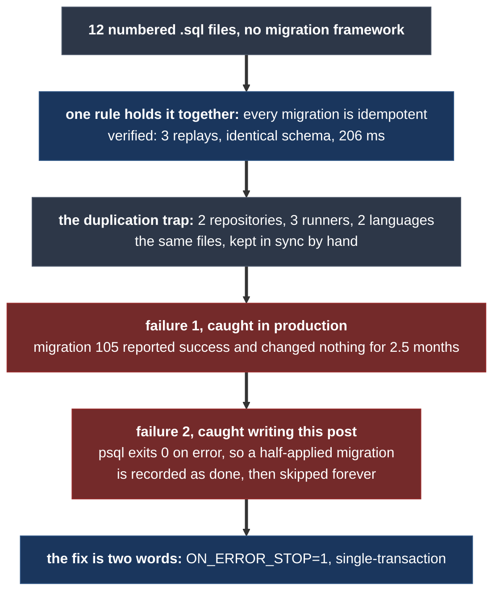
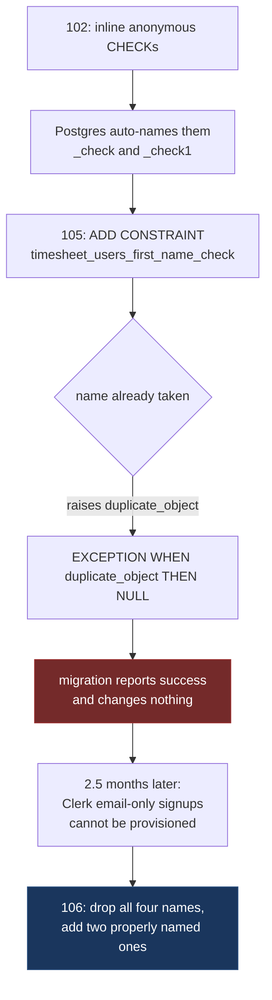
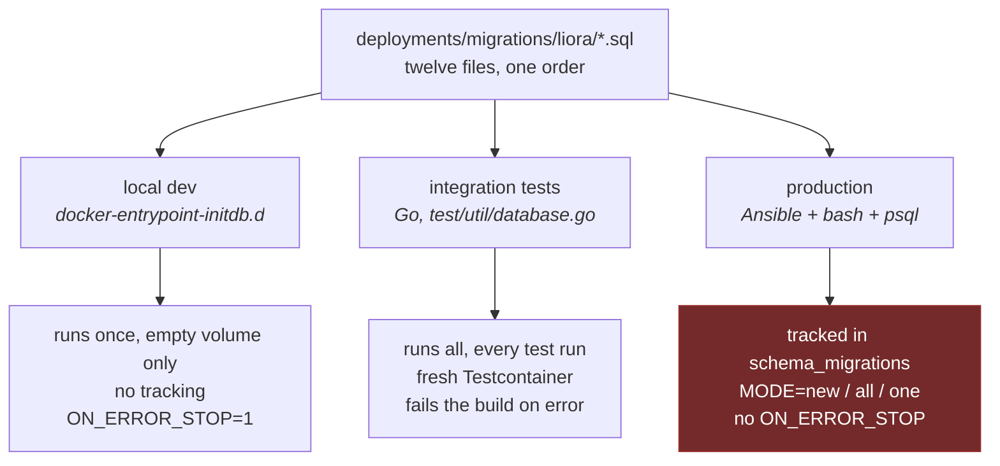

# My Postgres Migration Strategy: 12 Files, No Framework, and a Bug I Found in My Own Runner

App https://simpletimesheeet.eu <br>
Contents [contents.md](../contents.md)

---

Every Go project reaches the same fork in the road about a week in. You need to change the database schema, and you need to change it on a laptop, in CI, and on a production box, in that order, forever. The ecosystem has good answers: golang-migrate, goose, Atlas, and in the Java world Flyway and Liquibase, which have been solving this since before Go existed.

I did not use any of them. My migration strategy is twelve numbered `.sql` files in one directory, 675 lines total, applied by about sixty lines of bash inside an Ansible playbook. There are no down migrations. There is no checksum. The tracking table has two columns.

This post is that decision examined properly: the one rule the whole thing rests on, the vocabulary you need to satisfy that rule, and then the three ways the same twelve files are duplicated in my setup, which is what the title of this entry has been promising since the contents page.

Then the part I did not plan to write. While verifying the claims in this post against a real Postgres, I found a genuine bug in my own migration runner. It is two words wide, it has been there the whole time, and under the right failure it would silently record a half-applied migration as complete and then skip it forever. I reproduce it below with the exact code from the playbook, because a devlog that only reports the parts that worked is marketing.

Here is the whole post as one picture, so you know where each section is going:



## The whole strategy on one page

Here is everything. The migrations directory:

```
deployments/migrations/liora/
    001_create_keycloak_schema.sql
    101_create_timesheet_schema.sql
    102_create_timesheet_tables.sql
    103_init_timesheet_data.sql
    104_update_timesheet_days_validation.sql
    105_add_user_name_constraints.sql
    106_relax_user_name_constraints.sql
    106_seed_2026_test_timesheets.sql
    107_create_subscription_billing_tables.sql
    108_create_audit_log.sql
    109_create_consent_log.sql
    110_create_support_log.sql
```

Yes, there are two files numbered `106`. That is not a typo and I come back to it.

Applying them in production is a Make target:

```bash
make migration                                        # only unrecorded files
make migration MODE=all                               # re-run everything
make migration SQL=110_create_support_log.sql         # one specific file
```

Which runs a playbook whose entire tracking mechanism is this:

```sql
CREATE TABLE IF NOT EXISTS timesheet.schema_migrations (
    filename   TEXT        PRIMARY KEY,
    applied_at TIMESTAMPTZ NOT NULL DEFAULT NOW()
);
```

*(Code throughout is from the production repo, which is private, with license headers stripped.)*

And a bash loop that is short enough to read in full:

```bash
run_file() {
  local file="$1"
  local name
  name=$(basename "$file")
  echo "→ Applying $name ..."
  docker exec -i "$DB_CONTAINER" psql -U "$DB_USER" -d "$DB_NAME" < "$file"
  docker exec -i "$DB_CONTAINER" psql -U "$DB_USER" -d "$DB_NAME" \
    -c "INSERT INTO timesheet.schema_migrations (filename) VALUES ('$name') ON CONFLICT DO NOTHING;"
  echo "✓ $name recorded"
}

if [ -n "$SQL_FILE" ]; then
  run_file "$MIGRATIONS_DIR/$SQL_FILE"

elif [ "$MODE" = "all" ]; then
  for f in $(ls "$MIGRATIONS_DIR"/*.sql | sort); do
    run_file "$f"
  done

else
  applied=$(docker exec "$DB_CONTAINER" psql -U "$DB_USER" -d "$DB_NAME" -t -A \
    -c "SELECT filename FROM timesheet.schema_migrations;")
  for f in $(ls "$MIGRATIONS_DIR"/*.sql | sort); do
    name=$(basename "$f")
    if echo "$applied" | grep -qx "$name"; then
      echo "  skip $name (already applied)"
    else
      run_file "$f"
    fi
  done
fi
```

Three design decisions are hiding in there, and they are the whole post.

**Ordering is lexicographic on the filename.** Not on a parsed version number. `ls | sort`, nothing more.

**Identity is the filename.** The primary key of the tracking table is the literal basename. Not a version integer, not a content hash.

**`MODE=all` exists.** There is a supported, documented path that re-runs every migration against a database that already has all of them. That single line is load-bearing for everything below.

## The one rule: every migration is idempotent

Because `MODE=all` exists, every file in that directory has to survive being applied to a database where it has already been applied. Not "should ideally". Has to. It is the constraint that a framework would have enforced for me and that I now enforce by hand in every file I write.

The upside is that it makes the whole set replayable, which is a genuinely nice property to have on a bad day. Rebuilding a database from scratch, verifying a restored backup, or bringing up a box whose tracking table you no longer trust are all the same command. There is no state to reconcile because there is no state that matters: the files describe the schema, and running them all converges on it.

I did not want to assert that on vibes, so I tested it. Postgres 17.10 in Docker, empty database, apply all twelve files in sorted order three times in a row, then compare against a database that got exactly one pass.

```
--- PASS 1 ---
--- PASS 2 ---
--- PASS 3 ---
all passes completed
```

```
SCHEMA IDENTICAL after 1 pass vs 3 passes (307 lines of DDL compared)
```

Comparison is `pg_dump --schema-only` on the `timesheet` schema, diffed line by line. The seed data is stable too, which matters because two of those files insert rows:

| table | rows after 1 pass | rows after 3 passes |
|---|---:|---:|
| `timesheet_users` | 2 | 2 |
| `timesheet` | 4 | 4 |

And the cost of the replay, which is the number that makes `MODE=all` a reasonable thing to offer at all:

| | Time |
|---|---:|
| Cold apply, empty database | 222 ms |
| Warm re-apply, everything already present | 206 ms |

Two hundred milliseconds to replay my entire schema history. At that price, "just run them all again" is a legitimate operational answer rather than a thing you brace for.

The warm run is also self-documenting about how idempotency is actually achieved, because Postgres narrates it:

```
NOTICE:  schema "timesheet" already exists, skipping
NOTICE:  relation "timesheet_users" already exists, skipping
NOTICE:  relation "audit_log_occurred_at_idx" already exists, skipping
NOTICE:  constraint "timesheet_users_first_name_check1" of relation "timesheet_users" does not exist, skipping
```

## The vocabulary of idempotent DDL

Satisfying that rule turns out to require a specific and slightly obscure vocabulary. Here is every idiom actually used across my twelve files, which between them cover most of what you can do to a Postgres schema:

| What you want | The idempotent form |
|---|---|
| A schema | `CREATE SCHEMA IF NOT EXISTS` |
| A table | `CREATE TABLE IF NOT EXISTS` |
| An index | `CREATE INDEX IF NOT EXISTS` |
| A function | `CREATE OR REPLACE FUNCTION` |
| A trigger | `CREATE OR REPLACE TRIGGER` (Postgres 14+) |
| Seed rows | `INSERT ... ON CONFLICT DO NOTHING` |
| A column | `ALTER TABLE ... ADD COLUMN IF NOT EXISTS` |
| A constraint | nothing. See below. |

Two of those deserve more than a table row.

**`CREATE OR REPLACE TRIGGER` is newer than most people's habits.** It arrived in Postgres 14. Before that the idempotent form was `DROP TRIGGER IF EXISTS` followed by `CREATE TRIGGER`, which is two statements and a window in between where the trigger does not exist. My audit and consent logs are append-only, enforced by triggers that raise on any write:

```sql
CREATE OR REPLACE FUNCTION timesheet.audit_log_block_modify()
    RETURNS TRIGGER LANGUAGE plpgsql AS
$$
BEGIN
    RAISE EXCEPTION 'timesheet.audit_log is append-only: % is not permitted', TG_OP;
END;
$$;

CREATE OR REPLACE TRIGGER audit_log_no_update
    BEFORE UPDATE ON timesheet.audit_log
    FOR EACH ROW
EXECUTE FUNCTION timesheet.audit_log_block_modify();
```

Those exist for GDPR Article 30 and the CJEU's CCOO ruling on working-time records, which is post 47's territory. What matters here is that `CREATE OR REPLACE` makes tamper-proofing replayable, so re-running migration 108 never leaves a window where the guard is off.

**Seeds key on the business identity, not the surrogate one.** My seed rows generate a fresh UUID every time they run, so the primary key is useless as an idempotency key. The conflict target is the natural key instead:

```sql
INSERT INTO timesheet.timesheet (id, user_id, month, year, ...)
VALUES (gen_random_uuid(), 'b4a4c4d4-...', 7, 2025, ...)
ON CONFLICT (user_id, month, year) DO NOTHING;
```

That is the `UNIQUE (user_id, month, year)` from [the JSONB post](08-postgres-jsonb-one-column.md) doing a second job. `ON CONFLICT DO NOTHING` with no target would also have worked, but naming the constraint says out loud which identity I consider real.

## The one Postgres will not help you with

Look at the last row of that table again. Adding a constraint has no idempotent form. This is not an oversight I can work around with a flag:

```
liora=# ALTER TABLE timesheet.support_log ADD CONSTRAINT IF NOT EXISTS chk_x CHECK (user_id IS NOT NULL);
ERROR:  syntax error at or near "NOT"
LINE 1: ...TER TABLE timesheet.support_log ADD CONSTRAINT IF NOT EXISTS...
```

`ADD COLUMN IF NOT EXISTS` works. `ADD CONSTRAINT IF NOT EXISTS` does not exist, in Postgres 17, today. So you write the exception handler yourself, and that is what migration 105 does:

```sql
DO $$
BEGIN
    ALTER TABLE timesheet.timesheet_users
        ADD CONSTRAINT timesheet_users_first_name_check
            CHECK (char_length(first_name) BETWEEN 2 AND 50
                   AND first_name ~ '^[A-Za-z]+( [A-Za-z]+)*$');
EXCEPTION
    WHEN duplicate_object THEN NULL;
END $$;
```

Catch `duplicate_object`, do nothing, carry on. It is the standard trick and you will find it in every hand-rolled migration setup on the internet.

It is also, in this specific file, how I shipped a migration that did absolutely nothing for two and a half months.

## The trap: an exception handler that swallowed the wrong exception

Here is the failure, traced end to end against a real database, because this is the most instructive thing in the repo.

Migration 102 created the users table with its constraints written inline and **unnamed**:

```sql
CREATE TABLE IF NOT EXISTS timesheet.timesheet_users
(
    id         UUID PRIMARY KEY,
    first_name VARCHAR(100) NOT NULL
        CHECK (char_length(first_name) BETWEEN 2 AND 50)
        CHECK (first_name ~ '^[A-Za-z]+( [A-Za-z]+)*$'),
    last_name  VARCHAR(100) NOT NULL
        CHECK (char_length(last_name) BETWEEN 2 AND 50)
        CHECK (last_name ~ '^[A-Za-z]+( [A-Za-z]+)*$'),
    ...
);
```

Anonymous constraints still need names, so Postgres invents them. Here is what it invented, read straight out of `pg_constraint` after applying 102 to an empty database:

```
timesheet_users_first_name_check   CHECK (char_length(first_name) >= 2 AND char_length(first_name) <= 50)
timesheet_users_first_name_check1  CHECK (first_name ~ '^[A-Za-z]+( [A-Za-z]+)*$')
timesheet_users_last_name_check    CHECK (char_length(last_name) >= 2 AND char_length(last_name) <= 50)
timesheet_users_last_name_check1   CHECK (last_name ~ '^[A-Za-z]+( [A-Za-z]+)*$')
```

The naming rule is `{table}_{column}_check`, and on collision Postgres appends an integer. Two anonymous checks on one column gets you `_check` and `_check1`.

Now apply migration 105, which wants to add a constraint named `timesheet_users_first_name_check`. That name is already taken by something 102 created accidentally. So the `ALTER TABLE` raises `duplicate_object`, the handler catches it, and the block returns cleanly:

```
$ psql -f 105_add_user_name_constraints.sql
DO
DO
```

Two successful statements. Exit code zero. Green in every log. And the constraints afterwards:

```
timesheet_users_first_name_check   CHECK (char_length(first_name) >= 2 AND char_length(first_name) <= 50)
timesheet_users_first_name_check1  CHECK (first_name ~ '^[A-Za-z]+( [A-Za-z]+)*$')
timesheet_users_last_name_check    CHECK (char_length(last_name) >= 2 AND char_length(last_name) <= 50)
timesheet_users_last_name_check1   CHECK (last_name ~ '^[A-Za-z]+( [A-Za-z]+)*$')
```

Byte for byte identical. Migration 105 changed nothing, reported success, and got recorded in `schema_migrations` as applied.

This is the real hazard of the `EXCEPTION WHEN duplicate_object THEN NULL` idiom, and it is worth naming precisely, because "catch and ignore" is advice you will find everywhere. The handler cannot distinguish **"this constraint is already here, so my work is done"** from **"a different constraint is squatting on this name, so my work will never be done."** Both raise `duplicate_object`. The idiom is written for the first case and silently absorbs the second.



### How it surfaced

Not through the migration. Through a user who could not log in.

Migration 105 landed on 2026-03-26. On 2026-06-11 I wired up Clerk as the identity provider, and Clerk lets people sign up with an email address and nothing else. No first name, no last name. The webhook and the lazy-provisioning path both insert a user row with empty strings, and 102's strict constraint, still very much alive because 105 never replaced it, rejected the row:

```
ERROR:  new row for relation "timesheet_users" violates check constraint "timesheet_users_first_name_check"
DETAIL:  Failing row contains (dd7260ed-..., , , nameless@example.com, ...)
```

The user existed at the identity provider, had a valid session, and had no row in my database. They could authenticate and then not fetch their own details. That is a nasty class of bug because the failure is two systems away from the cause.

The fix, migration 106, is the interesting part. It could not just add the right constraint, because it had no idea which mechanism had created the wrong one. So it drops every name either mechanism could have produced, then adds the relaxed rule:

```sql
DO $$
BEGIN
    -- Drop the strict constraints created inline in 102 (auto-named) and the
    -- equivalents from 105, if present.
    ALTER TABLE timesheet.timesheet_users
        DROP CONSTRAINT IF EXISTS timesheet_users_first_name_check,
        DROP CONSTRAINT IF EXISTS timesheet_users_first_name_check1,
        DROP CONSTRAINT IF EXISTS timesheet_users_last_name_check,
        DROP CONSTRAINT IF EXISTS timesheet_users_last_name_check1;

    ALTER TABLE timesheet.timesheet_users
        ADD CONSTRAINT timesheet_users_first_name_check
            CHECK (
                first_name = ''
                OR (char_length(first_name) BETWEEN 2 AND 50
                    AND first_name ~ '^[A-Za-z]+( [A-Za-z]+)*$')
            );
    -- same for last_name
END $$;
```

Note what changed structurally, and not just in the rule. This block is **drop-then-add**, which needs no exception handler at all: `DROP CONSTRAINT IF EXISTS` is genuinely idempotent, and after a successful drop the add cannot collide. It is idempotent by construction rather than by catching an error and hoping the error meant what you assumed.

Two lessons I actually apply now, in order of how much they would have saved me:

1. **Name every constraint at creation.** The four-line fix for all of this is writing `CONSTRAINT timesheet_users_first_name_length CHECK (...)` inline in 102. Anonymous constraints are fine until the day you need to drop one by name, and by then you are grepping `pg_constraint` on production.
2. **Prefer drop-then-add over catch-and-ignore.** If you must use the exception handler, it should be a last resort, and the thing it catches should be the thing you meant.

And the verification, which is the same one used everywhere else in this post: after 106, the nameless user inserts fine.

```
INSERTED ok
INSERT 0 1
```

## Roll forward only, and what migration 104 cost

The other structural decision: there are no down migrations. Not "I have not written them yet". There is no mechanism for them, no `.down.sql` convention, and no plan to add one.

That means changing a rule means replacing the whole thing. [The previous post](08-postgres-jsonb-one-column.md) mentioned migration 104 in passing as the file that relaxed the timesheet validator, and promised an explanation here. Here it is in full. Migration 104 is 86 lines of SQL. This is the entire semantic difference between it and the version in 102:

```diff
- THEN end_hour::TIME <= start_hour::TIME
- OR break_minutes >= EXTRACT(EPOCH FROM (end_hour::TIME - start_hour::TIME)) / 60
+ THEN end_hour::TIME < start_hour::TIME
+ OR break_minutes > EXTRACT(EPOCH FROM (end_hour::TIME - start_hour::TIME)) / 60
```

Two characters. `<=` became `<`, `>=` became `>`. To ship two characters I copied an 86-line `CREATE OR REPLACE FUNCTION` into a new file, because that is what "the file is the unit" means when the object is a function.

The behavioral difference, measured by calling the validator directly under each version:

| Input | Under 102 | Under 104 |
|---|---|---|
| A shift from 09:00 to 09:00 | rejected | allowed |
| A 2-hour break inside a 2-hour shift | rejected | allowed |

Both are boundary cases where the day nets out to zero worked hours, and both were rejections the Go validator did not make. That mismatch is the duplication trap from the last post in its original sense: the same rule living in SQL and in Go, drifting at the boundary, and 104 is the record of me going to make SQL agree with Go.

The cost of roll-forward-only is exactly this verbosity. The benefit is that there is no such thing as a down migration that was never tested, which in my experience is what down migrations mostly are. You write them, you never run them, and on the one night you need one it does not work. I would rather write a compensating forward migration under the pressure of a real incident than trust a rollback script I have never executed.

The related cost is that you carry your history. `001_create_keycloak_schema.sql` is still in the chain, still replayed on every `MODE=all`, and its entire body is this:

```sql
-- CREATE SCHEMA IF NOT EXISTS keycloak;
```

Commented out. Keycloak lost to Clerk, which is post 10's subject. The file stays because deleting a migration from a roll-forward chain is a decision about every database that ever ran it, and a fully commented-out file costs me nothing but a line in `ls`.

## The duplication trap, in three parts

Now the thing this entry is named after. There is not one duplication in this setup. There are three, and they are different in kind.

### One: the same twelve files live in two repositories

The migrations exist here:

```
timesheet-services/deployments/migrations/liora/
```

And here:

```
timesheet-infra/ansible/roles/timesheet_app/migrations/liora/
```

Same twelve names. The backend repo needs them because the local Docker Compose stack and the integration tests both apply them. The infra repo needs them because Ansible copies them to the server, and an Ansible role that reaches into a sibling git checkout for its own core assets is a role that only works on my laptop.

They are kept in sync by hand. The current state, checked as I wrote this:

```
$ diff -rq timesheet-services/deployments/migrations/liora \
           timesheet-infra/ansible/roles/timesheet_app/migrations/liora
$ echo $?
0
```

Byte-identical today. That is a fact about today, not a guarantee. Nothing enforces it. No CI check compares them, no symlink joins them, no build step copies one to the other. The failure mode is precise and unpleasant: I add migration 111 to the backend repo, the integration tests pass because that repo has the file, and then deployment applies eleven migrations to production because the infra repo does not. The tracking table would happily report full compliance with a schema history that is missing its newest member.

I know how to fix this. A git submodule, a CI job that diffs the directories, or making the Ansible role fetch from a published artifact. I have not done it, and the honest reason is that twelve files over four months is a low enough rate that the manual copy has not bitten me yet. That is not a good reason. It is a bet on my own diligence, and I am recording it here so that when it does bite me, the post that says so has this paragraph to point back at.

### Two: three different programs apply the same files

This one I find genuinely more interesting, because it is not sloppiness, it is three environments that legitimately need different behavior.



**Local development** mounts the directory into the Postgres image's init hook:

```yaml
postgres:
  container_name: liora-postgres
  image: postgres:17
  volumes:
    - ./migrations/liora:/docker-entrypoint-initdb.d
    - postgres_data:/var/lib/postgresql/data
```

The official entrypoint runs every `*.sql` in there in alphabetical order, but only when the data directory is empty. So a new migration does not reach a developer's existing database at all. The workflow is `docker compose down -v` and start over, which is tolerable precisely because the seed migrations put usable test data back.

**Integration tests** use a third implementation, in Go, against a fresh Testcontainer:

```go
func ApplyMigrations(db *gorm.DB) error {
    root, err := findRepoRoot()
    if err != nil {
        return err
    }
    files, err := collectMigrationFiles(filepath.Join(root, "deployments", "migrations"))
    if err != nil {
        return err
    }
    for _, path := range files {
        content, err := os.ReadFile(path)
        if err != nil {
            return fmt.Errorf("read %s: %w", path, err)
        }
        if err := db.Exec(string(content)).Error; err != nil {
            return fmt.Errorf("exec %s: %w", path, err)
        }
    }
    return nil
}
```

`sort.Strings` on full paths, execute everything, fail the test run on any error. No tracking table, because the database is thrown away afterwards. This is the piece that saves the whole arrangement, and it is worth being explicit about why: **the integration suite applies the real production migration files from scratch on every run.** Not a schema dump, not an `AutoMigrate` call, not a fixture. If a migration is syntactically broken or ordered wrong, the test suite refuses to start. That is the regression test for the migration strategy itself, and it is post 18's subject.

**Production** is the Ansible bash loop from the top of this post.

Three runners, three sets of semantics, one directory of files. The unifying requirement is the idempotency rule, which is now doing more work than it first appeared to: it is what lets three programs with three different notions of "already applied" produce the same database.

### Three: the same rule in SQL and in Go

Covered in [the JSONB post](08-postgres-jsonb-one-column.md), and migration 104 above is the fossil of it drifting. Two validators, deliberately, because they answer different questions: Go answers "what do I tell the user" and SQL answers "what do I refuse to store". The migration strategy's contribution to that problem is that when they do drift, the fix is a new file with the whole function in it.

## The bug I found writing this post

Here is the part I did not expect to be writing.

Look again at `run_file`, the function at the heart of the production runner:

```bash
docker exec -i "$DB_CONTAINER" psql -U "$DB_USER" -d "$DB_NAME" < "$file"
docker exec -i "$DB_CONTAINER" psql -U "$DB_USER" -d "$DB_NAME" \
  -c "INSERT INTO timesheet.schema_migrations (filename) VALUES ('$name') ON CONFLICT DO NOTHING;"
```

Line one applies the SQL. Line two records it as applied. The script runs under `set -euo pipefail`, so if line one fails, line two never happens. That was my mental model, and the `set -e` is right there in the file, which is exactly the kind of detail that stops you from checking further.

**`psql` reading a script does not stop on error, and does not exit non-zero.** Not by default. It reports the error, continues to the next statement, and exits 0.

That is not a claim I want to make on memory, so here it is against Postgres 17.10, using a three-statement file whose middle statement references a table that does not exist:

```
--- exactly how migrate.yml invokes psql (no ON_ERROR_STOP) ---
CREATE TABLE
ERROR:  relation "public.table_that_does_not_exist" does not exist
CREATE TABLE
psql exit code: 0
```

Statement one committed. Statement two failed. Statement three committed. Exit code zero.

Now the consequence, running the real `run_file` verbatim against that file:

```
-> Applying broken.sql ...
CREATE TABLE
ERROR:  relation "public.table_that_does_not_exist" does not exist
CREATE TABLE
OK broken.sql recorded

=== tracking table thinks: ===
broken.sql
=== database actually has: ===
step_one
step_three
=== the column that was supposed to exist: ===
0
```

The migration failed in the middle, printed `✓ recorded`, and `set -e` never fired. `schema_migrations` now permanently believes that file is applied. Every future `make migration` prints `skip broken.sql (already applied)` and moves on. The missing column stays missing until someone notices at runtime, and the tracking table actively hides the cause.

There is a second half to it. Even if the exit code were correct, `psql` running a script wraps each statement in its own transaction. A migration that fails at statement five has already committed statements one through four. Postgres has fully transactional DDL, which is one of the best things about it, and this invocation throws that away.

Both halves have the same two-word fix:

```bash
psql -U "$DB_USER" -d "$DB_NAME" -v ON_ERROR_STOP=1 --single-transaction -f "$file"
```

Verified on the same broken file:

```
--- with ON_ERROR_STOP=1 --single-transaction ---
CREATE TABLE
psql:/tmp/broken.sql:2: ERROR:  relation "public.table_that_does_not_exist" does not exist
psql exit code: 3

=== tables left behind: ===
0
```

Exit code 3, so `set -e` aborts the loop and the file is never recorded. Zero tables left behind, so the database is exactly where it started. A migration now either fully happens or fully does not.

The detail that stings is that **my local development environment already had this right, and had it for free.** The official Postgres image's entrypoint runs init scripts like this:

```
local query_runner=( psql -v ON_ERROR_STOP=1 --username "$POSTGRES_USER" --no-password --no-psqlrc )
```

`ON_ERROR_STOP=1`, right there in someone else's script. So for the entire life of this project, a broken migration would have loudly failed on my laptop and quietly half-applied on production. The environment with the least at stake was the strictest one, and the environment with paying users on it was the most forgiving. I had it precisely backwards, and the only reason it has not cost me anything is that no migration has failed mid-file yet.

Which is the actual argument for using a framework, and it is not the one people usually make. It is not that golang-migrate has features I want. It is that I would not have had to know about `ON_ERROR_STOP`.

## What I gave up

The bug above is one entry. Here is the rest of the bill, stated as plainly as I can.

**No checksums.** The tracking table stores a filename. It does not store a hash of the contents. So editing a migration that has already been applied is invisible: the runner sees the name, marks it done, and skips it forever. Demonstrated, by appending a column to an already-applied migration 110 and running `MODE=new`:

```
  skip 110_create_support_log.sql (already applied)
=== does the new column exist? ===
0
```

Flyway and golang-migrate hash migration contents and refuse to proceed when a previously-applied file has changed. That check exists because editing applied migrations is the single most common way a team's databases silently diverge. I do not have it. What I have instead is a one-person team and a rule I follow: applied files are append-only, and a change means a new number. A rule in my head is strictly worse than a constraint in a tool, and this is the gap I would close first if anyone else ever commits to this repo.

**No advisory lock.** Two concurrent `make migration` runs would race. Frameworks take a `pg_advisory_lock` so the second one waits. I have one deployer and a manual trigger, so the race requires me to run the same command twice in two terminals on purpose.

**The version number is decoration.** Ordering is `sort` on the filename, so the digits are a sorting hint rather than an identity. Which is how I ended up with two files numbered `106`:

```
106_relax_user_name_constraints.sql
106_seed_2026_test_timesheets.sql
```

Both applied, in that order, deterministically, because `relax` sorts before `seed`. It works. It works by accident. The order of two files with the same number is decided by their description, which is not a property anyone would design on purpose, and a tool that treated the number as a primary key would have caught it at the moment I created it.

**No rollback.** Covered above. Deliberate.

**Nothing enforces cross-repo sync.** Covered above. Not deliberate, just unpaid.

## What I would keep

Having listed all that, I am not switching, and I want to be precise about which parts are actually load-bearing rather than just familiar.

**Plain SQL files are the real win, and they are orthogonal to the tooling.** Every migration in this repo is SQL that I can paste into `psql` to see what it does. There is no DSL, no Go struct that generates DDL, no `AutoMigrate` inferring my schema from my types. The validator function from the JSONB post is a hundred lines of SQL with CTEs and regexes, and there is no ORM abstraction that would let me express it, let alone review it. Notably, golang-migrate and goose would also give me this. Choosing SQL files is a separate decision from choosing to hand-roll the runner, and it is the one I would defend hardest.

**Idempotency is worth the effort even where a tool would not require it.** Once every file is safely replayable, disaster recovery, backup verification, and "I do not trust this database" all collapse into one 206-millisecond command. Frameworks do not ask for this property, and having it anyway has been worth more than the tracking table.

**The integration suite applying real migrations from scratch is not optional.** It is the only thing in the whole arrangement that automatically verifies the files are correct and correctly ordered. If I removed one piece of this setup and kept everything else, this is the piece whose absence would have hurt most.

**The thing I would change is the runner, not the strategy.** Concretely, and in priority order: `ON_ERROR_STOP=1 --single-transaction`, which is done; a checksum column in `schema_migrations`; and a CI job that diffs the two migration directories. That is an afternoon of work and it closes every gap in this post that is not deliberate.

## The verdict

Twelve SQL files, 675 lines, 222 milliseconds to apply from nothing, applied by three different programs across laptop, CI and production, with two columns of state to show for it. It has carried the schema of a product with paying users through four months, an identity provider migration, a billing system, and two GDPR compliance features.

It also contained a migration that reported success while doing nothing for two and a half months, and a runner that would record a half-applied migration as complete. I found the first one in production, via a user who could not log in. I found the second one by sitting down to write this post and refusing to state anything I had not run.

That second one is the argument for this whole devlog format, as far as I am concerned. The strategy is fine. The fix is two words. Neither of those was going to be discovered by explaining the strategy from memory, and the version of this post where I do not check is a version where the bug is still there.

Next, post 10, I go up a layer to authentication and the migration that file `001` is a headstone for: one auth layer, two identity providers, and how Keycloak lost to Clerk without the core of the backend noticing.

---

*Everything measured here was run against Postgres 17.10 in Docker on an Apple M4 Pro, using the actual twelve migration files from the production repository. The idempotency result compares `pg_dump --schema-only` output after one pass against three passes, 307 lines of DDL. Timings are wall clock around a `psql -f` loop and include process startup, so they measure the operation as I actually run it rather than pure server time. The `run_file` reproduction uses the function verbatim from `ansible/playbooks/migrate.yml`. Application and infrastructure code is from the private production repositories with license headers stripped. Further reading: [psql variables including ON_ERROR_STOP](https://www.postgresql.org/docs/17/app-psql.html), [ALTER TABLE](https://www.postgresql.org/docs/17/sql-altertable.html), and [CREATE TRIGGER](https://www.postgresql.org/docs/17/sql-createtrigger.html).*
