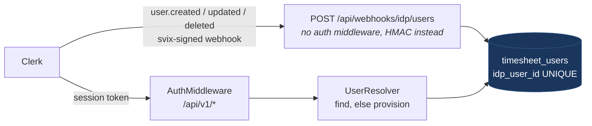

# One Auth Layer, Two Identity Providers

App https://simpletimesheeet.eu <br>
Contents [contents.md](../contents.md)

---

My backend authenticated its users against a self-hosted Keycloak for the first months of this project, and it authenticates them against Clerk today. I built that first version myself, directly against OpenID Connect, and it consisted of a Keycloak container in `docker-compose.yml`, a realm called `liora`, a provisioner that created the realm and the `timesheet` client on boot, an oauth2-proxy in front of both, and a schema in my own Postgres for Keycloak to keep its tables in. The Go side of it was deliberately small, because all it had to do was fetch the JWKS from the realm's well-known endpoint, verify the RS256 signature on every bearer token, read the `sub` claim, and map that value to a row in my users table.

Replacing that arrangement was a cost decision rather than an architectural one, and it rested on two numbers that both moved in the same direction.

The first number is memory consumption, because Keycloak is a JVM application and it is priced accordingly. Sitting idle with a single realm and a handful of users, the container held roughly 700 MB resident, and that figure was the floor rather than the peak. Since this entire product runs on one small Hetzner box ([post 04](04-why-hetzner-instead-of-big-clouds.md)), 700 MB represents a material share of the machine, committed permanently to a service whose only job is to authenticate the same few people every morning. The local cost was of a different kind but no less irritating, because a JVM, a realm import and a proxy all had to finish starting before the first page of the application would render.

The second number is the size of the surface I would have had to build and maintain myself, since verifying a token is only the small half of authentication. The remaining half includes email verification that looks like a product rather than a stock administration page, password reset, social sign-in, multi-factor authentication, bot protection on the sign-up form, session management, and enough theming to hold all of it together visually. Keycloak is capable of most of that work, on the condition that I configure it, theme it, upgrade it and own it indefinitely, on a server I patch myself, for a product whose actual value to its users is a grid they fill in once a month. Clerk provides that entire surface from the first day, for less than the memory alone was worth to me.

The swap itself took five days, and the code that had to change was the provider adapter, the middleware wiring and a single configuration key. No repository changed, no timesheet logic changed, and no controller in the codebase became aware that anything had happened at all. The clearest record of what left the system is the first migration in my migrations directory, which now consists of a single commented-out line once the license header is removed:

```sql
-- CREATE SCHEMA IF NOT EXISTS keycloak;
```

This post describes the design that made a five-day swap possible, together with the evidence supporting it. Rather than simply assert that one middleware can serve two identity providers, I wrote six tests against the production middleware and had it demonstrate the property directly.

*(Code throughout is taken from the production repositories, which are private, with license headers stripped and long blocks trimmed to the part under discussion.)*

## Identity belongs to the database, not to the provider

Everything described below follows from a single column that was added in migration `102`, several months before I had any plan to change identity providers:

```sql
CREATE TABLE IF NOT EXISTS timesheet.timesheet_users
(
    id          UUID PRIMARY KEY DEFAULT gen_random_uuid(),
    first_name  VARCHAR(50),
    last_name   VARCHAR(50),
    email       VARCHAR(100) UNIQUE,
    idp_user_id VARCHAR(255) UNIQUE NOT NULL,
    ...
);

CREATE TABLE IF NOT EXISTS timesheet.timesheet
(
    id      UUID PRIMARY KEY DEFAULT gen_random_uuid(),
    user_id UUID NOT NULL REFERENCES timesheet.timesheet_users (id) ON DELETE CASCADE,
    ...
);
```

Every user in the system carries two identities at once, where `idp_user_id` holds the provider's opinion of who they are, which used to be a Keycloak UUID and is now a string of the form `user_2abc...`, while `id` is the identity my own database issues. Every other table in the schema, every foreign key, every audit row and every Stripe customer mapping refers to `id` and never to the provider's subject.

The alternative approach is not unreasonable, which is precisely why it is so common in tutorials: you take the provider's subject as your primary key, and in exchange you save a column and a lookup on every authenticated request. As long as the identity provider is a fixed part of the system, its user id really is a perfectly serviceable identifier, and the design reads as a simplification rather than a compromise.

The cost of that choice is entirely deferred to the day the provider stops being fixed. Had Clerk's `sub` been my primary key, changing providers would have required rewriting every foreign key in the database, and every user's accumulated timesheet history would have been anchored to a string issued by the company I was in the process of leaving. With the extra column in place, the provider owns exactly one field on exactly one table, which means that **the provider owns authentication while the database owns identity**.

That distinction produces the strategy in a single sentence, which is to translate at the edge, once, as early in the request as possible, and to keep everything behind that line entirely ignorant of which provider is currently in use.

## The translation happens once, at the edge

Exactly one component performs that translation, and it is the middleware that runs in front of every `/api/v1` route, shown here trimmed to the path that a valid request takes:

```go
func AuthMiddleware(keys idp.TokenKeySource, resolveUser UserResolver, authorizedParties []string) fiber.Handler {
	return func(fCtx fiber.Ctx) error {
		authHeader := fCtx.Get("Authorization")
		if !strings.HasPrefix(strings.ToLower(authHeader), "bearer ") {
			return fCtx.Status(fiber.StatusUnauthorized).JSON(fiber.Map{"error": ""})
		}
		tokenStr := strings.TrimSpace(authHeader[7:])

		parsedToken, err := jwt.Parse(tokenStr, func(t *jwt.Token) (any, error) {
			if _, ok := t.Method.(*jwt.SigningMethodRSA); !ok {
				return nil, fmt.Errorf("")
			}
			kidVal, ok := t.Header["kid"].(string)
			if !ok || kidVal == "" {
				return nil, fmt.Errorf("")
			}
			return keys.GetPublicKey(context.Background(), kidVal)
		})
		if err != nil || !parsedToken.Valid {
			return fCtx.Status(fiber.StatusUnauthorized).JSON(fiber.Map{"error": ""})
		}

		if len(authorizedParties) > 0 {
			azp := utils.ExtractClaim(parsedToken, "azp")
			if azp == "" || !slices.Contains(authorizedParties, azp) {
				return fCtx.Status(fiber.StatusUnauthorized).JSON(fiber.Map{"error": ""})
			}
		}

		subject, err := utils.ExtractUserID(parsedToken)
		// ... claims assembled from sub, email, first_name/given_name, last_name/family_name

		userID := subject
		if resolveUser != nil {
			userID, err = resolveUser(fCtx.Context(), claims)
			if err != nil || userID == "" {
				return fCtx.Status(fiber.StatusUnauthorized).JSON(fiber.Map{"error": ""})
			}
		}

		fCtx.Locals("authToken", tokenStr)
		fCtx.Locals("userID", userID)
		fCtx.Locals("idpUserID", subject)
		return fCtx.Next()
	}
}
```

The request path narrows at two specific points, and both of them are worth reading carefully. The call to `keys.GetPublicKey` is the only place in the entire request path that knows an identity provider exists at all, and even there it knows the provider as a single capability, namely something that turns a key id into an RSA public key. The call to `resolveUser` is the only place that converts a provider subject into an internal UUID, and once the middleware reaches its final line, every handler, service and repository downstream sees a `userID` value drawn from my own table with no remaining way to determine where it originally came from.

Claim extraction is intentionally tolerant about naming, accepting either `first_name` or `given_name`, either `last_name` or `family_name`, and four separate spellings of the email claim, because Clerk's session token template and Keycloak's default mapper agree on none of them. That tolerance is the entire compatibility layer between the two identity providers, and it amounts to nine lines of code.

The verification of the token itself, meaning why `jwt.Parse` is safe in this position, how a token claiming `alg=none` is handled, and what happens on expiry, is the subject of post 11, because this post deliberately stops at the seam.

## The claim is tested rather than asserted

The sentence "the same middleware works with two providers" is easy to write and almost never verified, largely because by the time anyone writes it down the old provider has already been deleted from the codebase. To avoid that, the test suite runs two fake identity providers, each of which is an RSA key pair together with an HTTP endpoint serving a JWKS document, since that document is the whole of the contract my backend actually depends on:

```go
func newFakeIDP(t *testing.T, kid string) *fakeIDP {
	key, _ := rsa.GenerateKey(rand.Reader, 2048)
	f := &fakeIDP{kid: kid, key: key}
	f.server = httptest.NewServer(http.HandlerFunc(func(w http.ResponseWriter, _ *http.Request) {
		f.hits++
		n := base64.RawURLEncoding.EncodeToString(f.key.N.Bytes())
		e := base64.RawURLEncoding.EncodeToString(big.NewInt(int64(f.key.E)).Bytes())
		_ = json.NewEncoder(w).Encode(map[string]any{
			"keys": []map[string]string{{"kid": f.kid, "kty": "RSA", "alg": "RS256", "use": "sig", "n": n, "e": e}},
		})
	}))
	t.Cleanup(f.server.Close)
	return f
}
```

Around those two fakes sit the real `AuthMiddleware`, the real client, a Fiber application, and a single handler that echoes back whatever `userID` value reached the request context. The first provider signs a token carrying a Keycloak-shaped subject and the second signs one carrying a Clerk-shaped subject, which produces the following run:

```
=== RUN   TestOneMiddlewareTwoProviders
    provider A subject seen by resolver: [keycloak-subject-uuid]
    provider B subject seen by resolver: [user_2abcDEF]
    the handler received the same internal user id from both
--- PASS: TestOneMiddlewareTwoProviders (0.11s)
=== RUN   TestTokenFromWrongProviderIsRejected
--- PASS: TestTokenFromWrongProviderIsRejected (0.12s)
=== RUN   TestAuthorizedPartyIsEnforced
--- PASS: TestAuthorizedPartyIsEnforced (0.05s)
=== RUN   TestExpiredAndUnsignedTokens
--- PASS: TestExpiredAndUnsignedTokens (0.06s)
=== RUN   TestJWKSIsCachedAcrossRequests
    50 authenticated requests caused 1 JWKS fetch(es)
--- PASS: TestJWKSIsCachedAcrossRequests (0.09s)
=== RUN   TestUnknownKidRefetchesJWKS
    unknown kid triggered a JWKS refresh: 2 fetches total
--- PASS: TestUnknownKidRefetchesJWKS (0.02s)
PASS
ok  	github.com/lioraplatform/liora-services/internal/pkg/middleware	0.836s
```

Two of those six results carry most of the weight of the argument. A valid, correctly signed and unexpired token issued by the *other* provider is rejected with a 401 and never reaches the resolver, because the key id in its header is absent from the JWKS that this instance is configured against, which means that the separation between the two providers is enforced by signature verification rather than by configuration hygiene. The `azp` check then rejects a token that was minted by the correct provider but intended for a different frontend, which is the failure mode Clerk's own documentation warns about and which no amount of signature checking on its own would catch.

The remaining tests establish the cost model of the design, which turns out to be the number most people assume rather than measure. Fifty authenticated requests produce exactly one outbound request to the provider, because the public key is held in memory for twelve hours, which means that steady-state authentication is a signature check against a key already resident in RAM, with no network call and no database read occurring before the resolver runs. When the provider rotates its keys, an unrecognised key id causes the JWKS to be refreshed immediately, which is the one situation where paying for a round trip is the correct behaviour.

## Provisioning happens over two independent paths

A user exists inside Clerk before they exist inside my database, and closing that window is where most of the interesting failure modes in an auth layer actually live, which is why it is served by two mechanisms rather than one.



The first path is the webhook, through which Clerk delivers `user.created`, `user.updated` and `user.deleted` events to an endpoint that deliberately sits outside the auth middleware, since a webhook carries no session token and is authenticated by an HMAC signature through svix instead.

The second path is the resolver, and it exists because the first path is not reliable enough to stand on its own. Webhooks arrive out of order, arrive late, are retried, and occasionally do not arrive at all, while the user in question has already completed sign-up and their browser is calling `/api/v1/users/current` right now. The resolver therefore provisions the user on first contact, treating the authenticated token itself as sufficient grounds to create the row:

```go
func NewUserResolver(repo api.UserRepository, log logger.AppLogger) middleware.UserResolver {
	return func(ctx context.Context, claims middleware.AuthClaims) (string, error) {
		user, err := repo.FindByIDPUserID(ctx, claims.IDPUserID)
		if err != nil {
			return "", err
		}
		if user != nil {
			return user.ID.String(), nil
		}

		if !canProvision(claims) {
			log.Warn("auth rejected: user not provisioned and token lacks email claim; configure Clerk session token template")
			return "", fmt.Errorf("user %s is not provisioned", claims.IDPUserID)
		}

		created, err := repo.Create(ctx, &model.TimesheetUser{
			FirstName: model.SanitizeName(claims.FirstName),
			LastName:  model.SanitizeName(claims.LastName),
			Email:     strings.TrimSpace(claims.Email),
			IDPUserID: claims.IDPUserID,
			...
		})
		if err != nil {
			// Concurrent request may have just inserted the same user (unique
			// constraint on idp_user_id). Re-fetch before giving up.
			existing, lookupErr := repo.FindByIDPUserID(ctx, claims.IDPUserID)
			if lookupErr == nil && existing != nil {
				return existing.ID.String(), nil
			}
			return "", err
		}
		return created.ID.String(), nil
	}
}
```

Two properties of that function are load-bearing, and both were learned from watching real sign-ups rather than from reasoning about them in advance.

**The race is resolved by the database rather than by a lock**, because a fresh sign-in issues several requests in parallel and the webhook can land in the middle of them, which means all of those requests can miss the `SELECT` and attempt an `INSERT`. One of them succeeds, the others violate the unique constraint on `idp_user_id`, and the recovery path is to re-read the row rather than to fail the request. This is the argument from [post 09](09-sql-migration-strategy.md) applied to identity, where the constraint acts as the concurrency control and the application code only has to be willing to lose the race gracefully.

**The log line names the fix rather than the symptom**, which matters because Clerk session tokens carry only `sub` and a few standard claims unless the token template is extended in the dashboard, and without an email claim there is nothing to provision a user from. Authentication failure and provisioning failure both return 401 to the caller, which is the correct behaviour for a public API and an unhelpful one during diagnosis, so the difference between them is carried in the log at the moment it occurs, including the exact setting that needs to change.

## The swap, measured

Provider selection is the piece that people generally expect to be complicated, and in practice it is a switch statement:

```go
func IDPClient() idp.IdentityProviderClient {
	switch viper.GetString("idp.provider") {
	case "clerk":
		return clerkidp.New(viper.GetString("idp.clerk.jwksUrl"), os.Getenv("CLERK_SECRET_KEY"))
	default:
		return keycloakidp.New(
			viper.GetString("idp.baseUrl"),
			viper.GetString("idp.realm"),
			viper.GetString("idp.client.id"),
			viper.GetString("idp.client.secret"),
		)
	}
}
```

On the configuration side, the Keycloak block is still present in the file as a comment, which costs nothing and documents the shape the other adapter expects:

```yaml
idp:
  provider: clerk
  clerk:
    jwksUrl: https://related-koi-77.clerk.accounts.dev/.well-known/jwks.json
  authorizedParties: http://localhost,http://localhost:3000
#   Keycloak implementation props
#   baseURL: http://localhost:8080/keycloak
#   realm: liora
#   client:
#     id: timesheet
#     secret: secret
```

Counting the actual work from git, the five auth files together with the svix helper account for 424 insertions and 80 deletions, with zero lines changed in any repository and zero lines changed in the timesheet domain. The `keycloak` container, its provisioner and the oauth2-proxy in front of them left `docker-compose.yml` entirely, removing 84 lines of local infrastructure that I no longer run or wait for, and returning the 700 MB that prompted the whole exercise to the machine.

Three things did change outside the adapter, and they are worth naming precisely because they represent the true surface area of an identity provider:

- **Account deletion had to follow the user to the provider**, since deleting an account locally has to delete the identity remotely as well, and this is the single management call the application makes. For Clerk that call is `DELETE /v1/users/{id}` against the Backend API using the secret key, where a 404 response counts as success, because an identity that is already absent is exactly the end state that was requested.
- **The webhook payload shape changed completely**, since a different provider means different JSON and one additional event to handle, namely `user.deleted`.
- **Token size in the browser turned out to matter**, because the Next.js application attaches a Clerk session token as a `Bearer` header on every call, and those tokens are large enough that the Fiber read buffer had to be raised to 64 KB.

One further difference sat below the API surface entirely and is the most transferable lesson in the post. Keycloak, in the way I had provisioned it, always supplied a first and last name, whereas Clerk does not, since a sign-up with an email address and a password produces no name at all until the user chooses to add one. Migration `106` therefore made the name optional, with a matching `SanitizeName` function in Go so that the database and the application can never disagree about what constitutes a valid name. **A port protects you from the shape of the API on the other side, but it does not protect you from the shape of the data**, and the data is where providers genuinely differ, in which claims exist, whether names are guaranteed, what an identifier looks like, and whether an email address is verified before the first token is issued.

## The port is two methods wide

A seam is only as good as the interface underneath it, so the interface carries what its callers require and nothing beyond that:

```go
// TokenKeySource supplies the public key used to verify a signed token.
type TokenKeySource interface {
	GetPublicKey(ctx context.Context, kid string) (*rsa.PublicKey, error)
}

// UserEraser removes an identity from the provider.
type UserEraser interface {
	DeleteUser(ctx context.Context, idpUserID string) error
}

// IdentityProviderClient is the wiring-time union of both capabilities.
type IdentityProviderClient interface {
	TokenKeySource
	UserEraser
}
```

There are two capabilities in that file because there are exactly two callers in the application. The middleware needs a public key for a given key id and therefore accepts a `TokenKeySource`, while the user service needs to remove an identity when it deletes an account and therefore holds a `UserEraser`. Nothing else in the application communicates with the identity provider at all, so nothing else appears in the port.

The second half of the arrangement matters more than the first, because **in Go the unit of dependency is the package rather than the type**. A narrow interface declared alongside its implementations still pulls every vendor SDK into anything that imports it, so `internal/pkg/idp` contains the ports and nothing else, while the implementations live in `internal/pkg/idp/clerkidp` and `internal/pkg/idp/keycloakidp`. The factory shown above imports both of those packages, and nothing else in the codebase imports either of them.

Measured on a working copy of the repository with `go list -deps`, that arrangement produces the following:

| measurement | result |
| --- | --- |
| transitive packages of the port package | 102, standard library only |
| vendor identity SDK packages in the domain service graph | 0 |
| vendor identity SDK packages in the middleware graph | 0 |
| transitive packages of the middleware | 308 |

The port resolves to 102 packages and every one of them ships with Go, which in practice means `context`, `crypto/rsa` and their own dependencies. The consequence is that a reader of `user_service.go` cannot determine from the import graph which identity provider sits behind it, and that property is the entire reason to write a port in the first place. Splitting one package into three does raise the command's total package count from 494 to 496, which is a reminder that cleaner dependency graphs are not always smaller ones, and it is the correct trade in this case.

## Verification happens at two layers

The Go middleware is not the first component that a token meets on the way in. The OpenResty gateway sitting in front of the API verifies the JWT at the edge using `resty.openidc` against its own cached JWKS, and it derives a per-user rate limiting key from the verified subject:

```lua
local json, err = openidc.bearer_jwt_verify(opts)
if err or not json or not json.sub then
    ngx.log(ngx.WARN, "edge jwt verify failed: ", err or "missing sub")
    return ngx.exit(ngx.HTTP_UNAUTHORIZED)
end
ngx.var.api_rate_limit_key = "u_" .. json.sub
```

Authenticated traffic is bucketed per Clerk user id at 60 requests per minute, and anything that fails verification is answered at the edge without ever reaching the Go process. The result is two independent implementations of the same check, one written in Lua and one in Go, both driven by the same JWKS document, standing in front of the only door into the product.

## The stack runs without an identity provider

There is one further mode of operation, and it is the reason local development remains inexpensive:

```go
if !IsFeatureEnabled("auth") {
	log.Warn("Authorization middleware disabled, using dev user from config (idp.auth.devUserID)")
	apiV1Group.Use(middleware.DevAuthMiddleware(viper.GetString("idp.auth.devUserID")))
} else {
	authorizedParties := utils.SplitAndTrim(viper.GetString("idp.authorizedParties"), ",")
	apiV1Group.Use(middleware.AuthMiddleware(deps.IDPClient, deps.UserResolver, authorizedParties))
}
```

`DevAuthMiddleware` sets a fixed user id and calls `Next()`, which allows the full stack to run on a laptop with no identity provider, no network connection and no sign-in flow at all. That mode is disabled in every deployed inventory, and it announces itself in the log the moment the process starts, so there is never any ambiguity about which mode a running instance is in.

## What I would keep

**The extra column** is the least expensive insurance in the schema, since `idp_user_id` sitting beside my own UUID is the only reason a provider migration was an adapter change rather than a data migration.

**A single translation point at the edge** means that one function converts a provider subject into an internal id, and everything downstream of it is provider-blind by construction rather than by discipline, which is why the arrangement survives review: there is nowhere else for the translation to plausibly live.

**Two provisioning paths, both idempotent**, give the system a webhook and a lazy resolver with a unique constraint acting as the arbiter between them, because either mechanism on its own has a failure mode that presents to the user as a broken account on their first day.

**A port sized to its callers** keeps two capabilities for two callers, with the implementations in their own packages and no vendor SDK anywhere in the domain's import graph.

**Log lines that name the fix** are worth writing deliberately, and "user is not provisioned; add email to Clerk session token template" is the most useful sentence in the entire auth package.

## The verdict

I built the OpenID Connect integration myself, ran it against a self-hosted Keycloak for months, and moved to Clerk once the cost was clear both in memory and in the feature surface I would otherwise have had to build and maintain indefinitely. What made that move cheap was not the quality of the adapter code but the decision recorded in migration `102`, which kept the provider's identifier in one column and my own identifier in every relation.

Two identity providers, one middleware, one translation point and one column produced a swap that cost five days and 424 lines in the auth files, and nothing at all anywhere else in the system. The seam held because it was drawn in the schema before it was drawn in the code, and because the only component behind that seam which knows what an identity provider is, is a function that turns a key id into a public key.

Post 11 covers the layer this post deliberately skipped, meaning what actually happens inside `jwt.Parse`, why the algorithm check on the first line of that callback is not optional, and what a JWKS cache has to get right when the provider rotates its keys.

---

*Everything measured here was run against the production repositories on an Apple M4 Pro with Go 1.26.4. The six middleware tests use the real `AuthMiddleware` and the real Clerk client against two `httptest` JWKS servers, and are reproduced exactly as run. Package counts come from `go list -deps`. The package split described above was measured on a working copy of the repository. Timeline facts come from the repository's git history. Further reading: [Clerk session token claims and the azp check](https://clerk.com/docs/backend-requests/resources/session-tokens), [RFC 7517 JSON Web Key](https://datatracker.ietf.org/doc/html/rfc7517), and [svix webhook signature verification](https://docs.svix.com/receiving/verifying-payloads/how).*
